**参考资料**

[SpringCloud gateway （史上最全）](https://www.cnblogs.com/crazymakercircle/p/11704077.html)

[Spring Cloud Gateway全局过滤器GlobalFilter初探](https://segmentfault.com/a/1190000016252868)

[Spring Cloud Gateway实战案例（限流、熔断回退、跨域、统一异常处理和重试机制）](http://c.biancheng.net/view/5447.html)

[【源码系列】Spring Cloud Gateway](https://xie.infoq.cn/article/87d0c81f20f435d9b7dbcebfa)

[gateway原理](https://blog.csdn.net/qq_41948178/article/details/109480168)

[spring cloud gateway 启动流程及原理分析](https://www.jianshu.com/p/9b813f6ca4c2)

[Spring Cloud Gateway-过滤器工厂详解（GatewayFilter Factories）](https://my.oschina.net/eacdy/blog/4574519)【过滤】

[Spring-Cloud-Gateway 源码解析 —— 核心组件构建原理](https://www.iocoder.cn/Spring-Cloud-Gateway/ouwenxue/intro/ "Spring-Cloud-Gateway 源码解析 —— 核心组件构建原理")

## 正向代理和反向代理

### 正向代理

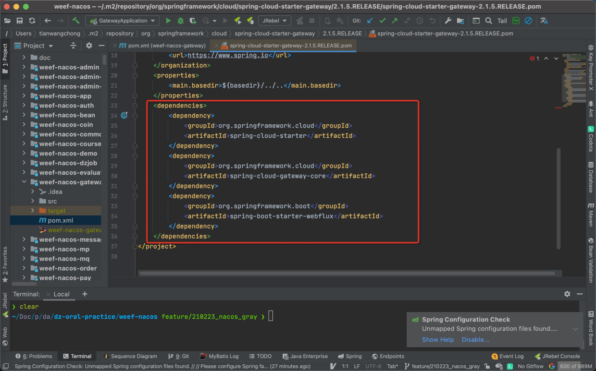

*   正向代理：代理服务器代理客户端发出请求。
*   正向代理服务器是一个位于客户端和远程服务器之间的服务器，为了从远程服务器获取内容，客户端向代理服务器发送一个请求并且指定远程服务器，然后代理服务器向远程服务器转交请求并将获取的内容返回给客户端。
*   客户端必须要进行一些特别的设置才能使用正向代理（比如你需要自己搭建VPN服务器，或者买一些第三方的服务）。

### 反向代理

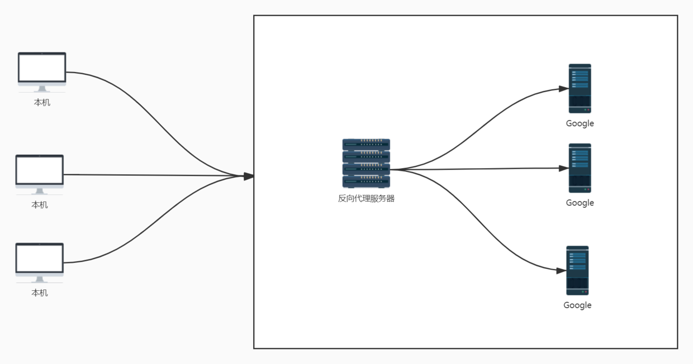

*   多个客户端给服务器发送请求，Nginx服务器收到请求之后，按照一定的规则分发给了后端的业务处理服务器进行处理。此时，请求的来源对于客户端是明确的，但是请求具体由那台服务器处理的并不明确，Nginx扮演的就是一个反向代理角色。客户端是无法感知代理的存在的，反向代理对外是透明的，访问者并不知道自己访问的是一个代理。因为客户端不需要任何配置就可以访问。
*   反向代理：代理的是服务端接收请求，主要用于服务器集群分布式部署的情况，反向代理隐藏了服务器的信息。
*   如果只是单纯的需要一个最基础的具备转发功能的网关，那么使用Nginx是一个不错的选择。

## 简介/特性

### Spring Cloud Gateway 的简介

Spring Cloud Gateway是由Spring官方基于Spring5、Spring Boot2、Project Reactor 等技术开发的网关，Spring Cloud Gateway 旨在为微服务架构提供一种简单有效的、统一的 API 路由管理方式。

Spring Cloud Gateway 作为 Spring Cloud 生态系中的网关，其目标是替代 Netflix Zuul，它不仅提供统一的路由方式，并且基于 Filter 链的方式提供了网关基本的功能，例如：安全、监控/埋点和限流等。

??? 【疑问】Spring Cloud Gateway 依赖 Spring Boot 和 Spring WebFlux，基于 Netty 运行。它不能在传统的 servlet 容器中工作，也不能构建成 war 包。

### Spring Cloud Gateway 的特性

*   Built on Spring Framework 5, Project Reactor and Spring Boot 2.0【基于 Spring Framework 5，Project Reactor 和 Spring Boot 2.0】

*   Able to match routes on any request attribute.【能匹配任意请求属性的路由】

*   Predicates and filters are specific to routes.【针对特定路由使用匹配策略和过滤器】

*   Circuit Breaker integration.【集成断路器】

*   Spring Cloud DiscoveryClient integration【集成服务发现】

*   Easy to write Predicates and Filters【易于写策略（断言）+过滤器】

*   Request Rate Limiting【 请求限流】

*   Path Rewriting【路径重写 - 自定义路由转发规则】

## 网关

**什么是网关?**

系统对外的唯一 "入口"。

**为什么需要网关?**

在微服务架构中，各个服务都是独立运行来完成某个特定领域的功能，服务间通过 REST API 或 RPC 进行通信。当前端一个请求发生时，比如查看商品详情，客户端可能要调用商品服务、库存服务、评价服务等多个微服务，如果客户端直接对接各个微服务，在复杂的调用过程中存在的问题：

1.  客户端需要发起多次请求，增加网络通信成本和客户端处理的复杂性

2.  服务的鉴权会分布在每个微服务中，存在重复鉴权

3.  微服务提供的接口协议不同（REST、RPC），客户端要对不同的协议进行适配

**网关的作用**

网关的出现可以解决这些问题，网关是微服务架构体系对外提供能力的统一接口，本质上是对请求进行转发、前置和后置的过滤：

*   对请求进行一次性鉴权、限流、熔断、日志

*   统一协议（常见 HTTP），屏蔽后端多种不同的协议

*   统一错误码处理

*   请求转发，实现内外网的隔离

*   通过请求分发规则，实现灰度发布

常见的 API 网关实现方案：Zuul（Netflix）、Gateway（Spring）、OpenResty（Nginx+lua）、Kong（Nginx+lua）。

**`术语:`** **在 Spring Cloud Gateway 中有如下几个核心概念需要我们了解：**

**1）Route**

Route 是网关的基本功能组件，表示一个具体的路由信息载体。由 一个唯一的ID、目标 URI、断言集合、过滤器集合组成。当请求到达网关时，由 Gateway Handler Mapping 通过断言进行路由匹配（Mapping），如果某个路由中的所有的断言都返回true，说明匹配到了这个路由。

**2）Predicate**

Predicate 是 Java8 中提供的一个函数。输入类型是 Spring Framework ServerWebExchange。它允许开发人员匹配来自 HTTP 的请求，例如请求头或者请求参数。简单来说它就是匹配条件。【匹配请求和 Route】

定义了 3 种逻辑操作方法：and/or/negate

```

public interface AsyncPredicate<T> extends Function<T, Publisher<Boolean>> {
    default AsyncPredicate<T> and(AsyncPredicate<? super T> other) {
        // 两个 Predicate 同时满足
    }

    default AsyncPredicate<T> negate() {
        // 对 Predicate 匹配结果取反
    }

    default AsyncPredicate<T> or(AsyncPredicate<? super T> other) {
        // 两个 Predicate 只需满足其一
    }
}
```

**3）Filter**

在特定的过滤器工厂类中有很多基于 `Spring Framework GatewayFilter` 构造的实例。在这里面可以拦截修改请求数据和响应数据。

【Filter 作用于请求代理之前或之后，最终是通过 filter chain 形成链式调用的，每个 filter 处理完 pre filter 逻辑后委派给 filter chain，filter chain 再委派给下一下 filter。】

例子

```yaml
spring:
  cloud:
    gateway:
      discovery:
        locator:
          # 开启小写验证，默认根据服务名查找都是用的全大写
          lowerCaseServiceId: true
          enabled: true
      routes:
        - id: app
          uri: lb://weef-dz-app
          predicates:
            - Path=/apis/**
          filters:
            - StripPrefix=1
        - id: weef-dz-app
          uri: lb://weef-dz-app
          predicates:
            - Path=/api/app/**
          filters:
            - StripPrefix=2
        - id: teacher-app
          uri: lb://weef-dz-teacher-app
          predicates:
            - Path=/api/teacher/**
          filters:
            - StripPrefix=2
        - id: weef-dz-kd-server
          uri: lb://weef-dz-kd-server
          predicates:
            - Path=/api/kd/**
          filters:
            - StripPrefix=2
        - id: weef-dz-agent-app
          uri: lb://weef-dz-agent-app
          predicates:
            - Path=/api/agent/**
          filters:
            - StripPrefix=2
        - id: weef-dz-kd-server
          uri: lb://weef-dz-activity-server
          predicates:
            - Path=/api/act/**
          filters:
            - StripPrefix=2
```

各字段含义如下：

*   id：自定义的路由 ID，保持唯一
*   uri：目标服务地址，支持普通 URL 和 `lb://${服务名称}` （表示从注册中心获取服务的地址）
*   predicates：路由条件，Predicate 接受一个输入参数，返回一个布尔值结果。该接口包含多种默认方法来将 Predicate 组合成其他复杂的逻辑（比如：与，或，非）。
*   filters：过滤规则

> Spring Cloud Gateway 并没有依赖 Tomcat，而是用 NettyWebServer 来启动服务监听（从启动日志可以看到）

```
2021-03-01 19:01:04.057  INFO 81929 --- [           main] o.s.b.web.embedded.netty.NettyWebServer  : Netty started on port(s): 9901
```

## spring cloud gateway的包结构

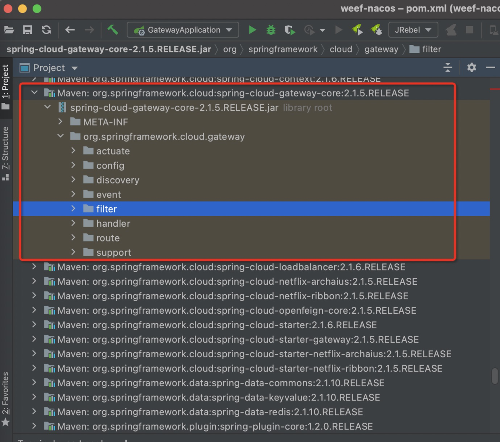

这个包是 `spring-cloud-gateway-core` 。这里是真正的spring-cloud-gateway的实现的地方。

打开 `spring-cloud-starter-gateway` 的pom文件可以看到引入了`spring-cloud-start`，`spring-boot-starter-webflux`，`spring-cloud-gateway-core`


### 分析 `cloud-gateway-core` 这个jar包。

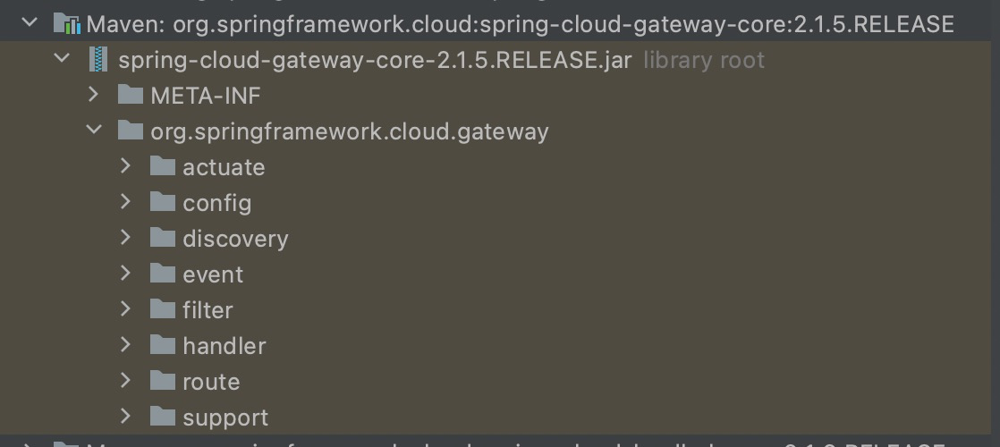

1. `actuate` 中定义了 `GatewayControllerEndpoint` 类，它提供了一些对外访问的接口，可以获取网关的一些信息，比如路由的信息，改变路由地址等等

```
    // 查询路由
    @GetMapping({"/routes"})
    public Flux<Map<String, Object>> routes() {
        return this.routeLocator.getRoutes().map(this::serialize);
    }

    // 查询指定路由信息
    @GetMapping({"/routes/{id}"})
    public Mono<ResponseEntity<Map<String, Object>>> route(@PathVariable String id) {
        return this.routeLocator.getRoutes().filter((route) -> {
            return route.getId().equals(id);
        }).singleOrEmpty().map(this::serialize).map(ResponseEntity::ok).switchIfEmpty(Mono.just(ResponseEntity.notFound().build()));
    }

// 以下方法是继承于父类，抽象类AbstractGatewayControllerEndpoint
    // 刷新路由缓存
    @PostMapping({"/refresh"})
    public Mono<Void> refresh() {
        this.publisher.publishEvent(new RefreshRoutesEvent(this));
        return Mono.empty();
    }

    @GetMapping({"/globalfilters"})
    public Mono<HashMap<String, Object>> globalfilters() {
        return this.getNamesToOrders(this.globalFilters);
    }

    @GetMapping({"/routefilters"})
    public Mono<HashMap<String, Object>> routefilers() {
        return this.getNamesToOrders(this.GatewayFilters);
    }

    @GetMapping({"/routepredicates"})
    public Mono<HashMap<String, Object>> routepredicates() {
        return this.getNamesToOrders(this.routePredicates);
    }

    @PostMapping({"/routes/{id}"})
    public Mono<ResponseEntity<Object>> save(@PathVariable String id, @RequestBody RouteDefinition route) {
        return Mono.just(route).filter(this::validateRouteDefinition).flatMap((routeDefinition) -> {
            return this.routeDefinitionWriter.save(Mono.just(routeDefinition).map((r) -> {
                r.setId(id);
                log.debug("Saving route: " + route);
                return r;
            })).then(Mono.defer(() -> {
                return Mono.just(ResponseEntity.created(URI.create("/routes/" + id)).build());
            }));
        }).switchIfEmpty(Mono.defer(() -> {
            return Mono.just(ResponseEntity.badRequest().build());
        }));
    }

    @DeleteMapping({"/routes/{id}"})
    public Mono<ResponseEntity<Object>> delete(@PathVariable String id) {
        return this.routeDefinitionWriter.delete(Mono.just(id)).then(Mono.defer(() -> {
            return Mono.just(ResponseEntity.ok().build());
        })).onErrorResume((t) -> {
            return t instanceof NotFoundException;
        }, (t) -> {
            return Mono.just(ResponseEntity.notFound().build());
        });
    }

    @GetMapping({"/routes/{id}/combinedfilters"})
    public Mono<HashMap<String, Object>> combinedfilters(@PathVariable String id) {
        return this.routeLocator.getRoutes().filter((route) -> {
            return route.getId().equals(id);
        }).reduce(new HashMap(), this::putItem);
    }
```

2. `config` 包里定义了一些Autoconfiguration和一些properties。读取配置文件就在这里完成。【`config` 中定义了一些启动时去加载的类，配置路由信息和读取你的配置文件就在这里完成。】

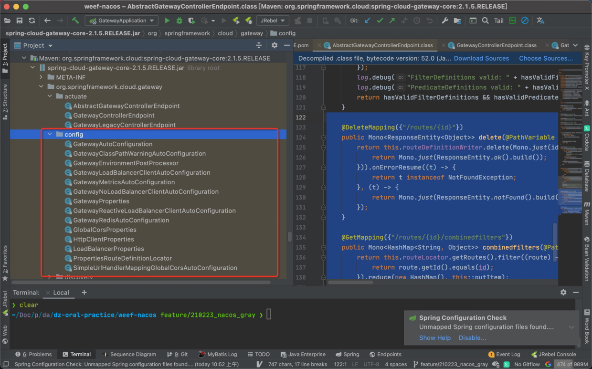

`GatewayProperties.java` 该类包括三个属性，路由列表，默认过滤器列表和MediaType列表。路由列表中的路由定义RouteDefinition。 过滤器中定义的FilterDefinition。

```
@ConfigurationProperties("spring.cloud.gateway")
@Validated
public class GatewayProperties {
    private final Log logger = LogFactory.getLog(this.getClass());
    @NotNull
    @Valid
    private List<RouteDefinition> routes = new ArrayList();
    private List<FilterDefinition> defaultFilters = new ArrayList();
    private List<MediaType> streamingMediaTypes;

    public GatewayProperties() {
        this.streamingMediaTypes = Arrays.asList(MediaType.TEXT_EVENT_STREAM, MediaType.APPLICATION_STREAM_JSON);
    }
```

3. `discovery` 定义了注册中心相关的内容，包括注册中心的路由等。

4. `event` 定义了一系列事件，都继承自 `ApplicationEvent` 。

5. `filter` 定义了spring gateway实现的一些过滤器，包括GatewayFilter，GlobalFilter。

6. `handler` 定义了很多Predicate相关的Factory

7. `route` 路由相关的东西

8. `support` 工具包

## 启动流程

网关启动第一步加载的就是去加载config包下的几个类。

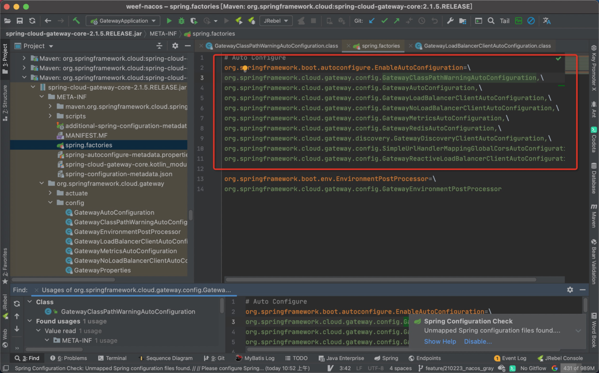

1. **GatewayClassPathWarningAutoConfiguration.class**:  指明了我们需要什么不需要什么，他加载于 `GatewayAutoConfiguration` 之前，如果DispatcherServlet存在，就会给与警告，同样的DispatcherHandler不存在也会警告【用于检查项目是否正确导入 `spring-boot-starter-webflux` 依赖，而不是错误导入 `spring-boot-starter-web` 依赖。】。

> 注意不要引入 `spring-boot-starter-web` 的依赖，会报错，因为gateway是基于 `spring-webflux` 开发的，他依赖的DispatcherHandler就和web里的DispatcherServlet是一样的功能

2. **GatewayLoadBalancerClientAutoConfiguration.class:**  Gateway负载均衡的过滤器实现的加载，他将 `LoadBalancerClientFilter` 注入到了容器中。【初始化 `LoadBalancerClientFilter` 实现负载均衡。】

3. **GatewayAutoConfiguration.class:**  注册初始化配置文件加载器、路由转发、过滤器、心跳监测。【这个里面定义了非常多的内容，我们大部分用到的过滤器，过滤器工厂都是在这里构建的。包括之前的gatewayControllerEndpoint也是在这里注入容器中的。】【实现多个核心 Bean 的初始化。】

```
@Configuration
// 开启网关，不写默认为true
@ConditionalOnProperty(
    name = {"spring.cloud.gateway.enabled"},
    matchIfMissing = true
)
@EnableConfigurationProperties
@AutoConfigureBefore({HttpHandlerAutoConfiguration.class, WebFluxAutoConfiguration.class})
@AutoConfigureAfter({GatewayLoadBalancerClientAutoConfiguration.class, GatewayClassPathWarningAutoConfiguration.class})
@ConditionalOnClass({DispatcherHandler.class})
public class GatewayAutoConfiguration {
    public GatewayAutoConfiguration() {
    }

    // spring cloud gateway基于Netty实现的，这里他这个静态内部类就是初始化netty需要的东西
    @Configuration
    @ConditionalOnClass({HttpClient.class})
    protected static class NettyConfiguration {
        protected NettyConfiguration() {
        }
        // ......
    }

    // 初始化了加载配置文件的对象，建立route
    @Bean
    public GatewayProperties gatewayProperties() {
        return new GatewayProperties();
    }

    // 初始化请求转发 过滤器
    @Bean
    @ConditionalOnProperty(
        name = {"spring.cloud.gateway.forwarded.enabled"},
        matchIfMissing = true
    )
    public ForwardedHeadersFilter forwardedHeadersFilter() {
        return new ForwardedHeadersFilter();
    }

        // 初始化gatewayControllerEndpoint 这里注意只有引入spring-boot-starter-actuator他才会加载
    @Configuration
    @ConditionalOnClass({Health.class})
    protected static class GatewayActuatorConfiguration {
        protected GatewayActuatorConfiguration() {
        }

        @Bean
        @ConditionalOnProperty({"spring.cloud.gateway.actuator.verbose.enabled"})
        @ConditionalOnEnabledEndpoint
        public GatewayControllerEndpoint gatewayControllerEndpoint(List<GlobalFilter> globalFilters, List<GatewayFilterFactory> gatewayFilters, List<RoutePredicateFactory> routePredicates, RouteDefinitionWriter routeDefinitionWriter, RouteLocator routeLocator) {
            return new GatewayControllerEndpoint(globalFilters, gatewayFilters, routePredicates, routeDefinitionWriter, routeLocator);
        }

        @Bean
        @Conditional({GatewayAutoConfiguration.OnVerboseDisabledCondition.class})
        @ConditionalOnEnabledEndpoint
        public GatewayLegacyControllerEndpoint gatewayLegacyControllerEndpoint(RouteDefinitionLocator routeDefinitionLocator, List<GlobalFilter> globalFilters, List<GatewayFilterFactory> gatewayFilters, List<RoutePredicateFactory> routePredicates, RouteDefinitionWriter routeDefinitionWriter, RouteLocator routeLocator) {
            return new GatewayLegacyControllerEndpoint(routeDefinitionLocator, globalFilters, gatewayFilters, routePredicates, routeDefinitionWriter, routeLocator);
        }
    }
}
```

4. **GatewayDiscoveryClientAutoConfiguration.class** 注册`DiscoveryClientRouteDefinitionLocator.class` ，在DiscoveryClientRouteDefinitionLocator的构造方法中通过discoveryClient获取服务发现中心的服务路由【通过注册中心发现的路由不是在config包下定义的而是在discovery包下GatewayDiscoveryClientAutoConfiguration实现了从注册中心发现内容】

这些注册完毕后，我们的配置文件就开始读取了。

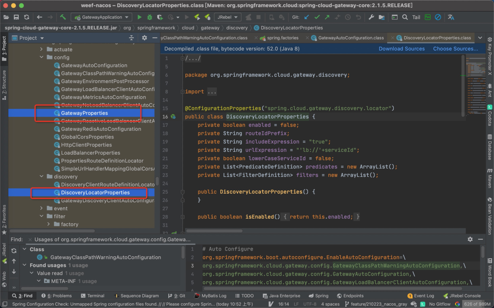

这两个中定义了我们配置文件的读取规则，其中 `DiscoveryLocatorProperties` 都有默认的值，可以不用关心。`GatewayProperties` 比较重要。

```
@ConfigurationProperties("spring.cloud.gateway")
@Validated
public class GatewayProperties {
    private final Log logger = LogFactory.getLog(this.getClass());
    @NotNull
    @Valid
    private List<RouteDefinition> routes = new ArrayList();
    private List<FilterDefinition> defaultFilters = new ArrayList();
    private List<MediaType> streamingMediaTypes;

    public GatewayProperties() {
        this.streamingMediaTypes = Arrays.asList(MediaType.TEXT_EVENT_STREAM, MediaType.APPLICATION_STREAM_JSON);
    }
```

这里就定义了我们配置文件里的所有路由信息，读取完成后，接下来就要变成真正的路由信息了。

这里就要说一下 `RouteLocator` 接口，这个接口提供了一个 `getRoutes()` 方法返回一个 `Flux<Route>` 所以，他的实现中就定义了读取配置文件转成路由的关键。

```
public interface RouteLocator {

 Flux<Route> getRoutes();

}
```

我们先看从配置文件中加载的路由信息也就是他的实现 `RouteDefinitionRouteLocator`

```
public class RouteDefinitionRouteLocator implements RouteLocator, BeanFactoryAware, ApplicationEventPublisherAware {
    public static final String DEFAULT_FILTERS = "defaultFilters";
    protected final Log logger = LogFactory.getLog(this.getClass());
    private final RouteDefinitionLocator routeDefinitionLocator;
    private final ConversionService conversionService;
    private final Map<String, RoutePredicateFactory> predicates = new LinkedHashMap();
    private final Map<String, GatewayFilterFactory> gatewayFilterFactories = new HashMap();
    private final GatewayProperties gatewayProperties;
    private final SpelExpressionParser parser = new SpelExpressionParser();
    private BeanFactory beanFactory;
    private ApplicationEventPublisher publisher;
    @Autowired
    private Validator validator;

    public RouteDefinitionRouteLocator(RouteDefinitionLocator routeDefinitionLocator, List<RoutePredicateFactory> predicates, List<GatewayFilterFactory> gatewayFilterFactories, GatewayProperties gatewayProperties, ConversionService conversionService) {
        this.routeDefinitionLocator = routeDefinitionLocator;
        this.conversionService = conversionService;
        this.initFactories(predicates);
        gatewayFilterFactories.forEach((factory) -> {
            GatewayFilterFactory var10000 = (GatewayFilterFactory)this.gatewayFilterFactories.put(factory.name(), factory);
        });
        this.gatewayProperties = gatewayProperties;
    }
    // ......
}
```

属性 `routeDefinitionLocator` 中已经定义了我们的路由，只不过是代理对象。 这个属性所对应的接口 `RouteDefinitionLocator` 有很多种实现。

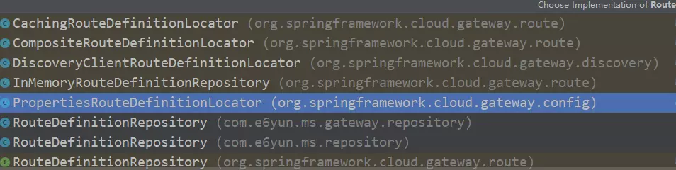

看下 `PropertiesRouteDefinitionLocator`

```
public class PropertiesRouteDefinitionLocator implements RouteDefinitionLocator {
    private final GatewayProperties properties;

    public PropertiesRouteDefinitionLocator(GatewayProperties properties) {
        this.properties = properties;
    }

    public Flux<RouteDefinition> getRouteDefinitions() {
        return Flux.fromIterable(this.properties.getRoutes());
    }
}
```

他的构造方法读取了 `GatewayProperties` ，所以到这里我们的路由就已经存在了。通过他的 `getRoutes()` 方法，我们就能方便的取出所有定义的路由信息了。

而他的 `getRoutes()` 方法又是这样定义的

5. **RouteDefinitionRouteLocator.class** 实现RouteLocator接口(内部是使用**PropertiesRouteDefinitionLocator**.class)读取GatewayProperties配置文件转成路由 `RouteDefinition`

6. **DiscoveryClientRouteDefinitionLocator.class** 实现RouteDefinitionLocator接口，getRouteDefinitions()时，通过discoveryClient转换服务发现中心的服务路由

## 工作流程

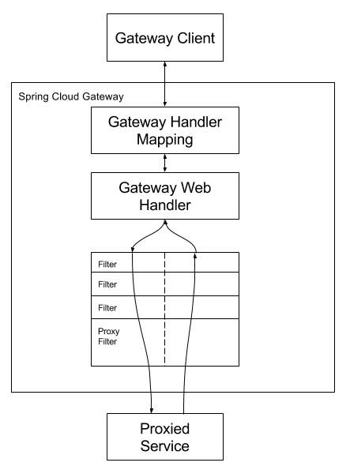

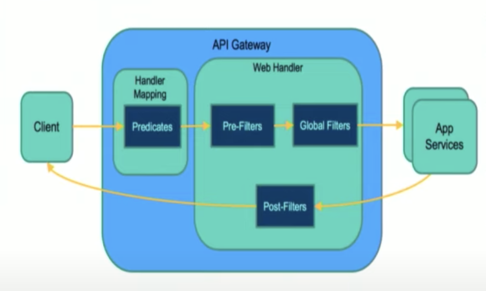

① Gateway 接收客户端请求。

② 客户端请求与路由信息进行匹配，匹配成功的才能够被发往相应的下游服务。

③ 请求经过 Filter 过滤器链，执行 pre 处理逻辑，如修改请求头信息等。

④ 请求被转发至下游服务并返回响应。

⑤ 响应经过 Filter 过滤器链，执行 post 处理逻辑。

⑥ 向客户端响应应答。

客户端向Spring Cloud Gateway发出请求。如果 `Gateway Handler Mapping` (网关处理程序映射)中找到与请求相匹配的路由，将其发送到 `Gateway Web Handler`(网关Web处理程序)。

`Gateway Web Handler` 再通过指定的过滤器链处理一系列过滤器（包括route中的自定义filter和系统自带的全局过滤器）进请求处理， 再将请求发送到我们实际的服务执行业务逻辑，然后返回。

过滤器之间用虚线分开是因为过滤器可能会在发送代理请求之前（“pre”）或之后（“post”）执行业务逻辑。

所有“前置”过滤器(Pre Filter)逻辑均被执行。然后发出代理请求。发出代理请求后，将运行“后置”过滤器(Post Filter)逻辑。

HttpWebHandlerAdapter->RoutePredicateHandlerMapping【获取到路由】->FilteringWebHandler【组合GlobalFilter和RouteFilter】->执行Filter

**路由匹配**

Spring WebFlux 的访问入口 `org.springframework.web.reactive.DispatcherHandler` （对应 MVC 中的 DispatcherServlet）

```

public class DispatcherHandler implements WebHandler, ApplicationContextAware {
    private List<HandlerMapping> handlerMappings;
    private List<HandlerAdapter> handlerAdapters;

    public Mono<Void> handle(ServerWebExchange exchange) {
        // 顺序使用 handlerMappings 获得对应的 WebHandler，invoke 执行
        return Flux.fromIterable(this.handlerMappings)
            // RoutePredicateHandlerMapping
            .concatMap((mapping) -> { return mapping.getHandler(exchange); })
            .next()
            .switchIfEmpty(this.createNotFoundError())
            // SimpleHandlerAdapter
            .flatMap((handler) -> { return this.invokeHandler(exchange, handler); })
            .flatMap((result) -> { return this.handleResult(exchange, result); });
    }
}
```

RoutePredicateHandlerMapping 匹配路由

```

public class RoutePredicateHandlerMapping extends AbstractHandlerMapping {
    private final FilteringWebHandler webHandler;
    private final RouteLocator routeLocator;
 	
    // mapping.getHandler(exchange); 会调用至此
    protected Mono<?> getHandlerInternal(ServerWebExchange exchange) {
        return this.lookupRoute(exchange)    // 匹配 Route
            .flatMap((r) -> {
                // ...
                return Mono.just(this.webHandler);
            })
            .switchIfEmpty(/**未匹配到 Route**/);
    }
}
```

**Filter chain 执行**

SimpleHandlerAdapter 循环执行 WebHandler，以 FilteringWebHandler 为例，创建 GatewayFilterChain 处理请求

```

public class SimpleHandlerAdapter implements HandlerAdapter {
    public Mono<HandlerResult> handle(ServerWebExchange exchange, Object handler) {
        WebHandler webHandler = (WebHandler)handler;
        Mono<Void> mono = webHandler.handle(exchange);
        return mono.then(Mono.empty());
    }
}

public class FilteringWebHandler implements WebHandler {
    public Mono<Void> handle(ServerWebExchange exchange) {
        Route route = (Route)exchange.getRequiredAttribute(ServerWebExchangeUtils.GATEWAY_ROUTE_ATTR);
        List<GatewayFilter> gatewayFilters = route.getFilters();
        List<GatewayFilter> combined = new ArrayList(this.globalFilters);
        // 合并 GlobalFilter 和 GatewayFilter，整体排序
        combined.addAll(gatewayFilters);
        AnnotationAwareOrderComparator.sort(combined);
			
        // 创建 GatewayFilterChain 处理请求
        return (new FilteringWebHandler.DefaultGatewayFilterChain(combined))
          .filter(exchange);
    }
}
```

Gateway的客户端会向Spring Cloud Gateway发起请求，请求首先会被**HttpWebHandlerAdapter进行提取组装成网关的上下文**，然后网关的上下文会传递到DispatcherHandler。

DispatcherHandler是所有请求的分发处理器，**DispatcherHandler主要负责分发请求对应的处理器**，比如将请求分发到对应RoutePredicateHandlerMapping(路由断言处理器映射器）。**路由断言处理映射器主要用于路由的查找**，以及找到路由后返回对应的FilteringWebHandler。**FilteringWebHandler主要负责组装Filter链表**并**调用Filter执行一系列Filter处理**，然后把请求转到后端对应的代理服务处理，处理完毕后，将Response返回到Gateway客户端。

在Filter链中，通过虚线分割Filter的原因是，过滤器可以在转发请求之前处理或者接收到被代理服务的返回结果之后处理。**所有的Pre类型的Filter执行完毕之后，才会转发请求到被代理的服务处理。被代理的服务把所有请求完毕之后，才会执行Post类型的过滤器。**

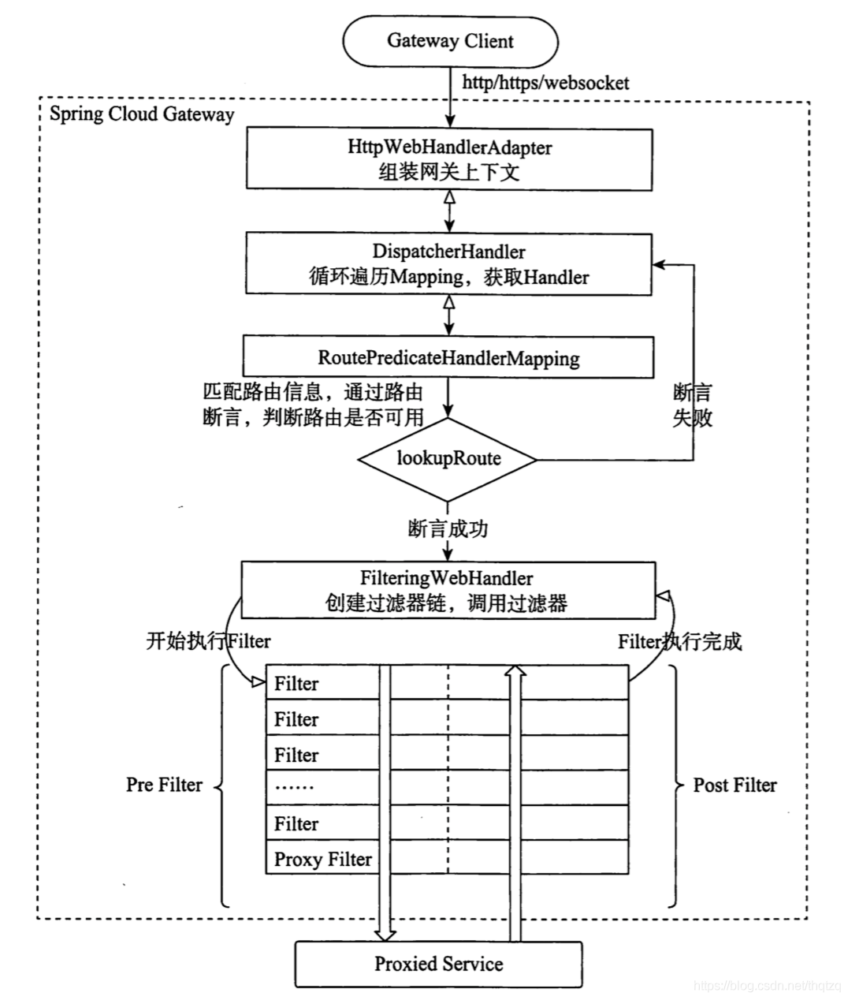

## 路由匹配规则

Spring Cloud Gateway 是通过 Spring WebFlux 的 HandlerMapping 做为底层支持来匹配到转发路由，Spring Cloud Gateway 内置了很多 Predicates 工厂，这些 Predicates 工厂通过不同的 HTTP 请求参数来匹配，多个 Predicates 工厂可以组合使用。

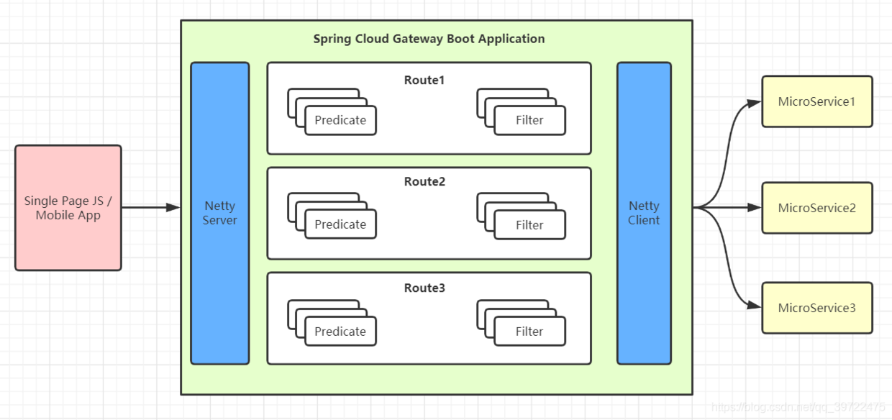

Gateway的主要功能之一是转发请求，转发规则的定义主要包含三个部分。

|                         |                                                              |
| ----------------------- | ------------------------------------------------------------ |
| Route（路由）           | 路由是网关的基本单元，由ID、URI、一组Predicate、一组Filter组成，根据Predicate进行匹配转发。 |
| Predicate（谓语、断言） | 路由转发的判断条件，目前SpringCloud Gateway支持多种方式，常见如：Path、Query、Method、Header等，写法必须遵循 key=vlue的形式 |
| Filter（过滤器）        | 过滤器是路由转发请求时所经过的过滤逻辑，可用于修改请求、响应内容 |

> 其中Route和Predicate必须同时申明

### 断言(Predicates)

Predicate 来源于 Java 8，是 Java 8 中引入的一个函数，Predicate 接受一个输入参数，返回一个布尔值结果。该接口包含多种默认方法来将 Predicate 组合成其他复杂的逻辑（比如：与，或，非）。可以用于接口请求参数校验、判断新老数据是否有变化需要进行更新操作。

在 Spring Cloud Gateway 中 Spring 利用 Predicate 的特性实现了各种路由匹配规则，有通过 Header、请求参数等不同的条件来进行作为条件匹配到对应的路由。

> 说白了 Predicate 就是为了实现一组匹配规则，方便让请求过来找到对应的 Route 进行处理。

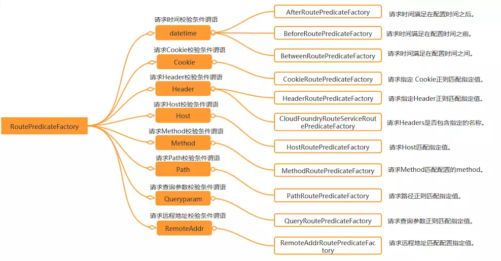

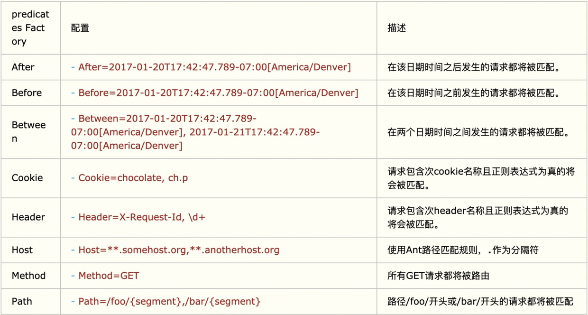

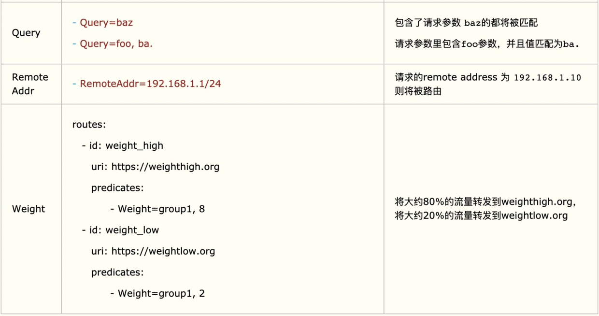

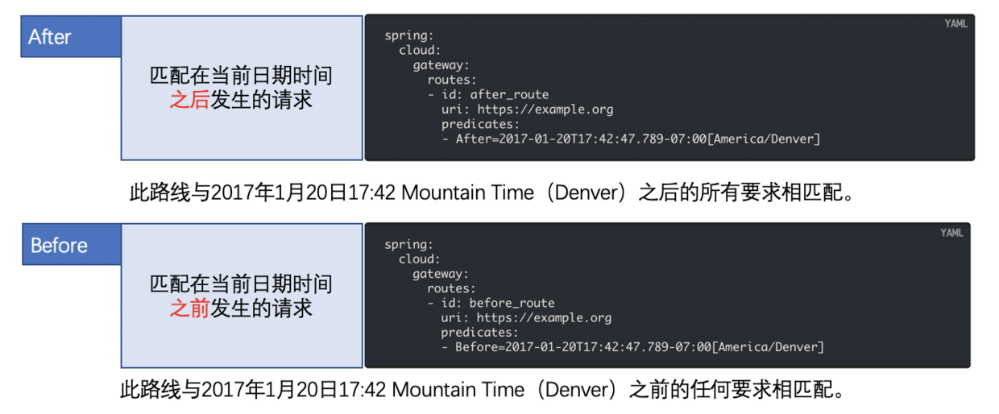


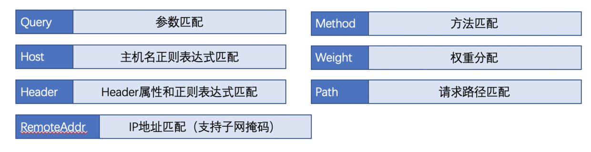

**通过时间匹配【After，Before，Between】**

Predicate 支持设置一个时间，在请求进行转发的时候，可以通过判断在这个时间之前或者之后进行转发。比如设置只有在2021年1月1日才会转发到www.baidu.com，在这之前不进行转发，就可以这样配置：

```
spring:
  cloud:
    gateway:
      routes:
       - id: baidu
        uri: https://baidu.com.com
        predicates:
         - After=2021-01-01T06:06:06+08:00[Asia/Shanghai]
```

通过 ZonedDateTime 来对时间进行的对比，ZonedDateTime 是 Java 8 中日期时间功能里，用于表示带时区的日期与时间信息的类，ZonedDateTime 支持通过时区来设置时间，中国的时区是：`Asia/Shanghai`。

After Route Predicate 是指在这个时间之后的请求都转发到目标地址。上面的示例是指，请求时间在 2021年1月1日6点6分6秒之后的所有请求都转发到地址 `https://baidu.com.com`。`+08:00`是指时间和UTC时间相差八个小时，时间地区为 `Asia/Shanghai`。

Before Route Predicate 刚好相反，在某个时间之前的请求的请求都进行转发。我们把上面路由规则中的 After 改为 Before即可。

除过在时间之前或者之后外，Gateway 还支持限制路由请求在某一个时间段范围内，可以使用 Between Route Predicate 来实现。

**通过 Cookie 匹配**

Cookie Route Predicate 可以接收两个参数，一个是 Cookie name ,一个是正则表达式，路由规则会通过获取对应的 Cookie name 值和正则表达式去匹配，如果匹配上就会执行路由，如果没有匹配上则不执行。

**通过 Header 属性匹配**

Header Route Predicate 和 Cookie Route Predicate 一样，也是接收 2 个参数，一个 header 中属性名称和一个正则表达式，这个属性值和正则表达式匹配则执行。

**通过 Host 匹配**

Host Route Predicate 接收一组参数，一组匹配的域名列表，这个模板是一个 ant 分隔的模板，用`.`号作为分隔符。它通过参数中的主机地址作为匹配规则。

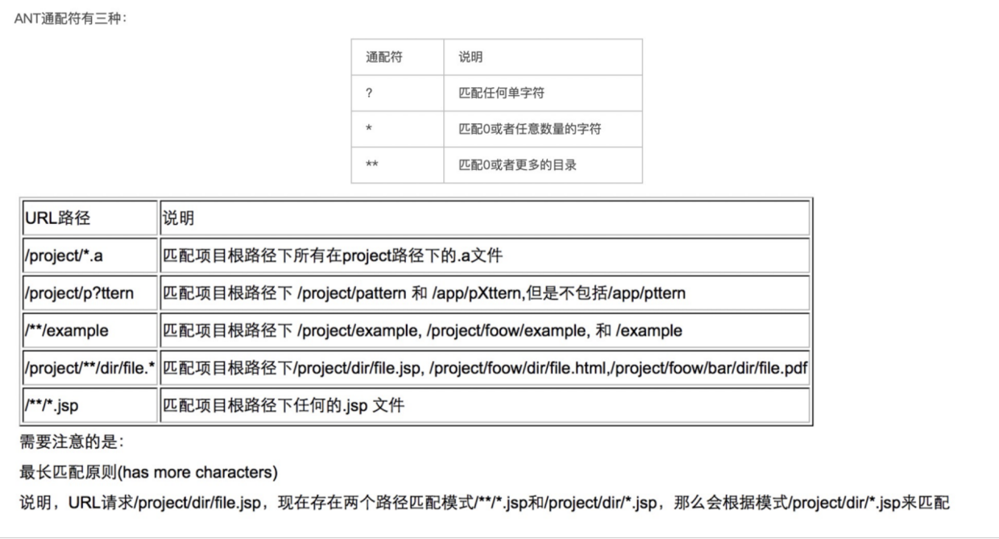

**通过请求方式匹配**

可以通过是 POST、GET、PUT、DELETE 等不同的请求方式来进行路由。

**通过请求路径匹配**

Path Route Predicate 接收一个匹配路径的参数来判断是否走路由。

**通过请求参数匹配**

Query Route Predicate 支持传入两个参数，一个是属性名一个为属性值，属性值可以是正则表达式。

**通过请求 ip 地址进行匹配**

Predicate 也支持通过设置某个 ip 区间号段的请求才会路由，RemoteAddr Route Predicate 接受 cidr 符号(IPv4 或 IPv6 )字符串的列表(最小大小为1)，例如 192.168.0.1/16 (其中 192.168.0.1 是 IP 地址，16 是子网掩码)。

**权重**

权重路由谓词工厂有两个参数：group和Weight（int）。每组计算重量。以下示例配置权重路由谓词：

```yaml
spring:
  cloud:
    gateway:
      routes:
      - id: weight_high
        uri: https://weighthigh.org
        predicates:
        - Weight=group1, 8
      - id: weight_low
        uri: https://weightlow.org
        predicates:
        - Weight=group1, 2
```

**组合使用 【一个请求满足多个路由的断言条件时，请求只会被首个成功匹配的路由转发】**

```yaml
spring:
  cloud:
    gateway:
      routes:
       - id: dazao
        uri: https://www.baidu.com.com
        predicates:
        - Host=**.dazao.com
        - Path=/headers
        - Method=GET
        - Header=X-Request-Id, \d+
        - Query=foo, ba.
        - Query=baz
        - Cookie=thc, lj.p
        - After=2021-01-01T06:06:06+08:00[Asia/Shanghai]
```

### 过滤器(Filter)

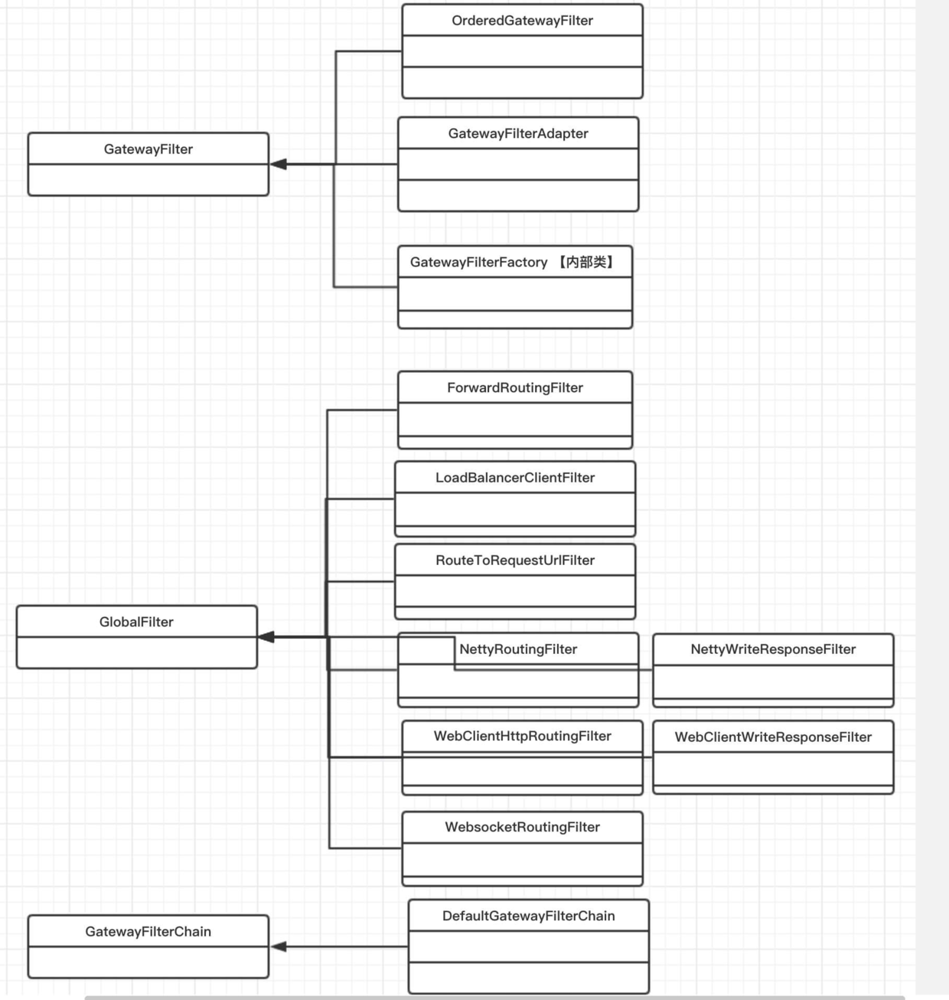

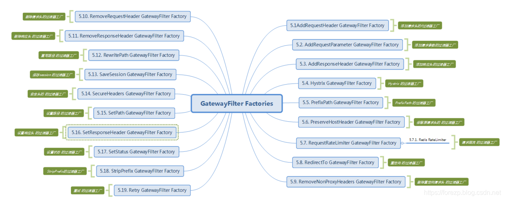

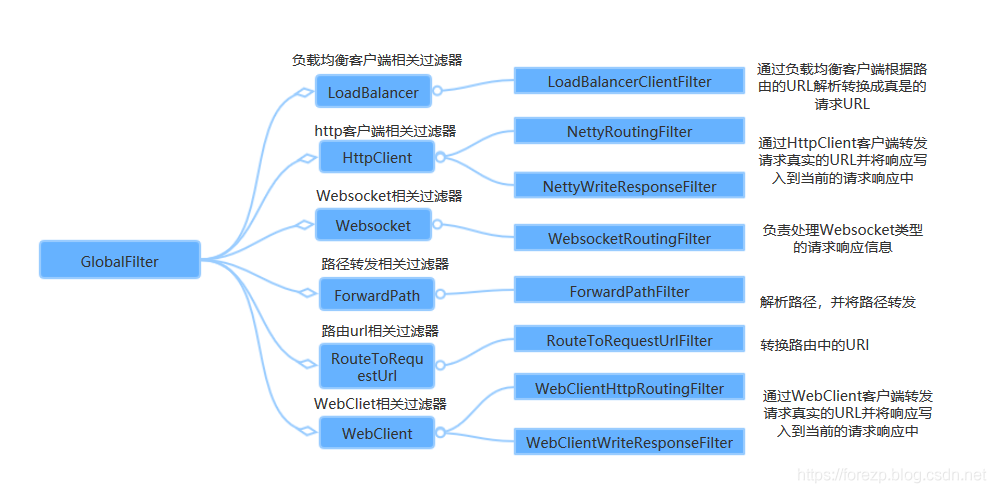

【问题:如何区分前置后后置?】Filter 分为前置（Pre）和后置（Post）两种类型：

在Spring Cloud Gateway源码中定义了一个Pre类型的Filter，code将会在chain.filter() 之前被执行,代码:[AddRequestHeader](https://github.com/spring-cloud/spring-cloud-gateway/blob/master/spring-cloud-gateway-core/src/main/java/org/springframework/cloud/gateway/filter/factory/AddRequestHeaderGatewayFilterFactory.java)

```
package org.springframework.cloud.gateway.filter.factory;

import org.springframework.cloud.gateway.filter.GatewayFilter;
import org.springframework.http.server.reactive.ServerHttpRequest;

/**
 * @author Spencer Gibb
 */
public class AddRequestHeaderGatewayFilterFactory extends AbstractNameValueGatewayFilterFactory {

    @Override
    public GatewayFilter apply(NameValueConfig config) {
        return (exchange, chain) -> {
            ServerHttpRequest request = exchange.getRequest().mutate()
                    .header(config.getName(), config.getValue())
                    .build();

            return chain.filter(exchange.mutate().request(request).build());
        };
    }

}
```

对于Post类型的Filter，[SetStatus](https://github.com/spring-cloud/spring-cloud-gateway/blob/master/spring-cloud-gateway-core/src/main/java/org/springframework/cloud/gateway/filter/factory/SetStatusGatewayFilterFactory.java) 代码将会在chain.filter(exchange).then()里面的代码运行。

```
public class SetStatusGatewayFilterFactory extends AbstractGatewayFilterFactory<SetStatusGatewayFilterFactory.Config> {
    @Override
    public GatewayFilter apply(Config config) {
        final HttpStatus status = ServerWebExchangeUtils.parse(config.status);
        return (exchange, chain) -> {

            return chain.filter(exchange).then(Mono.fromRunnable(() -> {
                // check not really needed, since it is guarded in setStatusCode,
                // but it's a good example
                if (!exchange.getResponse().isCommitted()) {
                    setResponseStatus(exchange, status);
                }
            }));
        };
    }
}
```

*   Pre 类型过滤器在请求转发到后端微服务之前执行，在 Pre 过滤器链中可以进行鉴权、限流等操作。

*   Post 类型过滤器在请求执行完成后，将结果返回给客户端之前执行。

Spring Cloud Gateway 中有两种 Filter 实现：`GatewayFilter` 和 `GlobalFilter` 。`GatewayFilter` 会应用到单个路由或一组路由上，`GlobalFilter` 会应用到所有路由上。

> 注：当配置多个filter时，优先定义的会被调用，剩余的filter将不会生效

#### 1. GatewayFilter

**AddRequestHeader**

为请求添加一个header：

```yaml
spring:
  cloud:
    gateway:
      routes:
      - id: add_request_header_route
        uri: https://example.org
        filters:
        - AddRequestHeader=X-Request-red, blue
```

**AddRequestParameter**

为请求添加一个查询参数：

```yaml
spring:
  cloud:
    gateway:
      routes:
        - id: ${serviceId}
          filters:
            - AddRequestParameter=foo, bar        # 请求增加 foo=bar 这个参数
```

**AddResponseHeader**

为请求的返回的 Header 中添加数据：

```
spring:
  cloud:
    gateway:
      routes:
        - id: ${serviceId}
          filters:
            - AddResponseHeader=X-Response-Foo, bar   
            # Response Header 添加 key=X-Response-Foo, Valuebar
```

**DedupeResponseHeader**

剔除重复的响应头。想要去重的Header如果有多个，用空格分隔即可。

去重策略：RETAIN_FIRST: 默认值，保留第一个值；RETAIN_LAST: 保留最后一个值；RETAIN_UNIQUE: 保留所有唯一值，以它们第一次出现的顺序保留

```yaml
spring:
  cloud:
    gateway:
      routes:
      - id: dedupe_response_header_route
        uri: https://example.org
        filters:
        - DedupeResponseHeader=Access-Control-Allow-Credentials Access-Control-Allow-Origin
```

**PrefixPath**

为匹配的路由添加前缀：

```
spring:
  cloud:
    gateway:
      routes:
      - id: prefixpath_route
        uri: https://example.org
        filters:
        - PrefixPath=/mypath
```

访问 `/hello` 的请求被发送到 `https://example.org/mypath/hello` 。

**RedirectTo**

重定向，配置包含重定向的状态码和地址：

- HTTP状态码应该是HTTP状态码300序列，例如301

- URL必须是合法的URL，并且该值会作为名为  `Location` 的Header。

上面配置表达的意思是： `${GATEWAY_URL}/hello` 会重定向到  `https://ecme.org/hello` ，并且携带一个 `Location:https://acme.org` 的Header。

```
spring:
  cloud:
    gateway:
      routes:
      - id: prefixpath_route
        uri: https://example.org
        filters:
        - RedirectTo=302, https://acme.org
```

**RemoveRequestHeader**

去掉某个请求头信息：

```
spring:
  cloud:
    gateway:
      routes:
      - id: removerequestheader_route
        uri: https://example.org
        filters:
        - RemoveRequestHeader=X-Request-Foo
```

去掉请求头信息 X-Request-Foo

**RemoveResponseHeader**

去掉某个响应头信息：

```
spring:
  cloud:
    gateway:
      routes:
      - id: removerequestheader_route
        uri: https://example.org
        filters:
        - RemoveResponseHeader=X-Request-Foo
```

**RewritePath**

改写路径（重写请求路径。）：

```
spring:
  cloud:
    gateway:
      routes:
      - id: rewrite_filter
        uri: http://localhost:8081
        predicates:
        - Path=/test/**
        filters:
        - RewritePath=/where(?<segment>/?.*), /test(?<segment>/?.*)
```

`/where/...` 改成 `test/...`

**SetPath**

设置请求路径，与 `RewritePath` 类似。

```
spring:
  cloud:
    gateway:
      routes:
      - id: setpath_route
        uri: https://example.org
        predicates:
        - Path=/red/{segment}
        filters:
        - SetPath=/{segment}
```

如 `/red/blue` 的请求被转发到 `/blue`。

**SetRequestHeader**

设置请求头信息。

```
spring:
  cloud:
    gateway:
      routes:
      - id: setrequestheader_route
        uri: https://example.org
        filters:
        - SetRequestHeader=X-Request-Red, Blue
```

**SetStatus**

设置响应的状态码，值可以是数字，也可以是字符串。但一定要是Spring HttpStatus 枚举类中的值。

```
spring:
  cloud:
    gateway:
      routes:
      - id: setstatusint_route
        uri: https://example.org
        filters:
        - SetStatus=401
```

**StripPrefix**

请求路径截取的功能（数字表示要截断的路径的数量）。

```
spring:
  cloud:
    gateway:
      routes:
      - id: nameRoot
        uri: https://nameservice
        predicates:
        - Path=/name/**
        filters:
        - StripPrefix=2
```

请求 `/name/blue/red` 会转发到 `/red` 。**`StripPrefix=2`就代表截取路径的个数。**

**RequestSize**

为后端服务设置收到的最大请求包大小。如果请求大小超过设置的值，则返回 `413 Payload Too Large` 。默认值是5M

```
spring:
  cloud:
    gateway:
      routes:
      - id: request_size_route
        uri: http://localhost:8080/upload
        predicates:
        - Path=/upload
        filters:
        - name: RequestSize
          args:
            maxSize: 5000000
```

超过5M的请求会返回413错误。

**Default-filters**

对所有请求添加过滤器。

```
spring:
  cloud:
    gateway:
      default-filters:
      - AddResponseHeader=X-Response-Default-Red, Default-Blue
      - PrefixPath=/httpbin
```

## 比较重要的几个filter-单独拉出来

### 权重负载

```
routes:
    - id: spring-cloud-client-demo
      uri: lb://spring-cloud-client-demo
      predicates:
        - Path=/client/**
        - Weight=group1, 2
      filters:
        - StripPrefix=1
    - id: spring-cloud-client-demo1
      uri: lb://spring-cloud-client-demo
      predicates:
        - Path=/client/**
        - Weight=group1, 8
      filters:
        - StripPrefix=1
```

### 限流

**默认：RequestRateLimiterGatewayFilterFactory限流过滤器和限流的实现类RedisRateLimiter使用令牌桶限流；**

Spring Cloud Gateway官方就提供了RequestRateLimiterGatewayFilterFactory这个类，使用Redis和Lua脚本实现了令牌桶的方式来限流。具体实现逻辑在RequestRateLimiterGatewayFilterFactory类中，lua脚本在如下图所示的文件夹中：

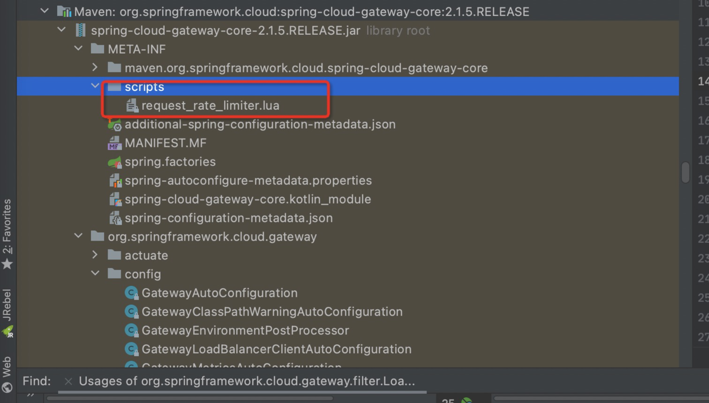

常用的限流算法有几种：**计数器算法、漏桶算法**和**令牌桶算法**

- 计数算法适合流量突发情况（瞬间突发）

- 令牌桶适合均速，无法获取令牌的请求直接拒绝

- 漏桶算法适合均速并且可以让请求进行等待，不需要直接拒绝请求

**计数器算法：**

维护一个单位时间内的计数器（例如：设置1s内允许请求次数10次)，表示为时间单位1秒内允许计数次数最高为10，每次请求计数器加1，当单位时间内计数器累加到大于设定的阈值(10)，则之后的请求都被拒绝，直到单位时间(1s)已经过去，再将计数器重置为零，缺点：如果在单位时间1s内允许100个请求，在10ms已经通过了100个请求，那后面的990ms所接收到的请求都会被拒绝，我们把这种现象称为“突刺现象”。

【计数器算法采用计数器实现限流有点简单粗暴，一般我们会限制一秒钟的能够通过的请求数，比如限流qps为100，算法的实现思路就是从第一个请求进来开始计时，在接下去的1s内，每来一个请求，就把计数加1，如果累加的数字达到了100，那么后续的请求就会被全部拒绝。等到1s结束后，把计数恢复成0，重新开始计数。具体的实现可以是这样的：对于每次服务调用，可以通过AtomicLong#incrementAndGet()方法来给计数器加1并返回最新值，通过这个最新值和阈值进行比较。这种实现方式，相信大家都知道有一个弊端：如果我在单位时间1s内的前10ms，已经通过了100个请求，那后面的990ms，只能眼巴巴的把请求拒绝，我们把这种现象称为“突刺现象”。】

**漏桶算法：**

水（请求）先进入到漏桶里，漏桶以一定的速度出水（接口响应速率），当水流入速度过大会直接溢出（访问频率超过接口响应速率），然后就拒绝请求，可以看出漏桶算法能强行限制数据的传输速率。

【漏桶算法为了消除"突刺现象"，可以采用漏桶算法实现限流，漏桶算法这个名字就很形象，算法内部有一个容器，类似生活用到的漏斗，当请求进来时，相当于水倒入漏斗，然后从下端小口慢慢匀速的流出。不管上面流量多大，下面流出的速度始终保持不变。不管服务调用方多么不稳定，通过漏桶算法进行限流，每10毫秒处理一次请求。因为处理的速度是固定的，请求进来的速度是未知的，可能突然进来很多请求，没来得及处理的请求就先放在桶里，既然是个桶，肯定是有容量上限，如果桶满了，那么新进来的请求就丢弃。

在算法实现方面，可以准备一个队列，用来保存请求，另外通过一个线程池（ScheduledExecutorService）来定期从队列中获取请求并执行，可以一次性获取多个并发执行。

这种算法，在使用过后也存在弊端：无法应对短时间的突发流量。】

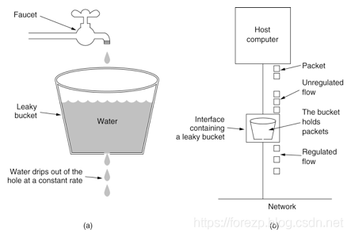

**令牌桶算法：**

解释1:随着时间流逝，系统会按恒定 1/QPS 时间间隔（如果 QPS=100，则间隔是 10ms）往桶里加入 Token（想象和漏洞漏水相反，有个水龙头在不断的加水），如果桶已经满了就不再加了。新请求来临时，会各自拿走一个 Token，如果没有 Token 可拿了就阻塞或者拒绝服务。

解释2:在令牌桶算法中，存在一个桶，用来存放固定数量的令牌。算法中存在一种机制，以一定的速率往桶中放令牌。每次请求调用需要先获取令牌，只有拿到令牌，才有机会继续执行，否则选择选择等待可用的令牌、或者直接拒绝。放令牌这个动作是持续不断的进行，如果桶中令牌数达到上限，就丢弃令牌，所以就存在这种情况，桶中一直有大量的可用令牌，这时进来的请求就可以直接拿到令牌执行，比如设置qps为100，那么限流器初始化完成一秒后，桶中就已经有100个令牌了，这时服务还没完全启动好，等启动完成对外提供服务时，该限流器可以抵挡瞬时的100个请求。所以，只有桶中没有令牌时，请求才会进行等待，最后相当于以一定的速率执行。【实现思路：可以准备一个队列，用来保存令牌，另外通过一个线程池定期生成令牌放到队列中，每来一个请求，就从队列中获取一个令牌，并继续执行。】

解释3:令牌桶的思路是，有大小固定的令牌桶，以恒定的速率源源不断地产生令牌（token）。如果令牌不被消耗，或者被消耗的速度小于产生的速度，令牌就会不断地增多，直到把桶填满，再产生的令牌就会从桶中溢出。每当一个请求过来时，就会尝试从桶里移除一个令牌，如果没有令牌的话，请求无法通过。【漏桶算法和令牌桶算法最明显的区别是令牌桶算法允许流量一定程度的突发。令牌桶取走 token 是不需要耗费时间的，假设桶内有100个 token 时，那么可以瞬间允许 100 个请求通过，而漏桶按指定速率执行这 100 个请求，漏桶的优势是流出速率平滑。 】

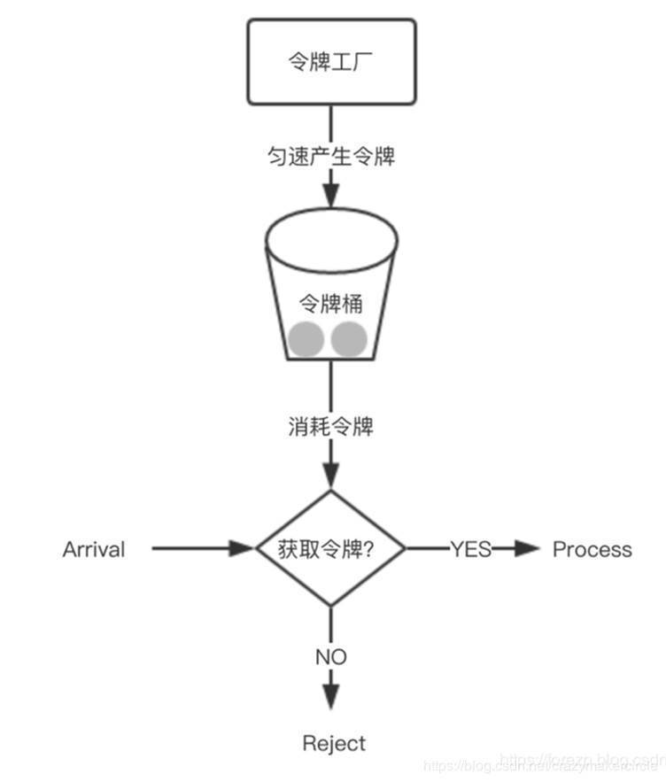

**首先在工程的pom文件中引入gateway的起步依赖和redis的reactive依赖，代码如下：**

1. `pom.xml`：

```yaml
<dependency>
    <groupId>org.springframework.cloud</groupId>
    <artifactId>spring-cloud-starter-gateway</artifactId>
</dependency>
<dependency>
  <groupId>org.springframework.boot</groupId>
  <artifactId>spring-boot-starter-data-redis-reactive</artifactId>
</dependency>
```

2. `application.yml` 配置如下：

```yaml
server:
  port: 8080
spring:
  cloud:
    gateway:
      routes:
        - id: limit_route
          uri: https://example.org
          predicates:
          - After=2019-02-26T00:00:00+08:00[Asia/Shanghai]
          filters:
          - name: RequestRateLimiter # 名称必须是 RequestRateLimiter
            args:
              key-resolver: '#{@hostAddrKeyResolver}' # 使用SpEL按名称引用bean
              redis-rate-limiter.replenishRate: 1 # 令牌桶的令牌填充速度，允许用户每秒处理多少个请求【# 每秒最大访问次数（放令牌桶的速率）】
              redis-rate-limiter.burstCapacity: 3 # 令牌桶的容量，允许在一秒钟内完成的最大请求数【# 令牌桶最大容量（令牌桶的大小）】
  application:
    name: gateway-limiter
  redis:
    host: localhost
    port: 6379
    database: 0
```

在上面的配置文件，指定程序的端口为8080，配置了 redis的信息，并配置了 `RequestRateLimiter` 的限流过滤器，该过滤器需要配置三个参数：

*   burstCapacity，令牌桶的容量，允许在一秒钟内完成的最大请求数【# 令牌桶最大容量（令牌桶的大小）】

*   replenishRate，允许用户每秒处理多少个请求。【# 每秒最大访问次数（放令牌桶的速率）】

*   key\-resolver，用于限流的键的解析器的 Bean 对象的名字。它使用 SpEL 表达式根据 `#{@beanName}` 从 Spring 容器中获取 Bean 对象。

主要是两个参数`redis-rate-limiter.replenishRate: 10`、`redis-rate-limiter.burstCapacity: 10`,前者控制往令牌桶丢令牌的速率，后者标识令牌桶的最大容量。

具体令牌桶算法可以参考下图：

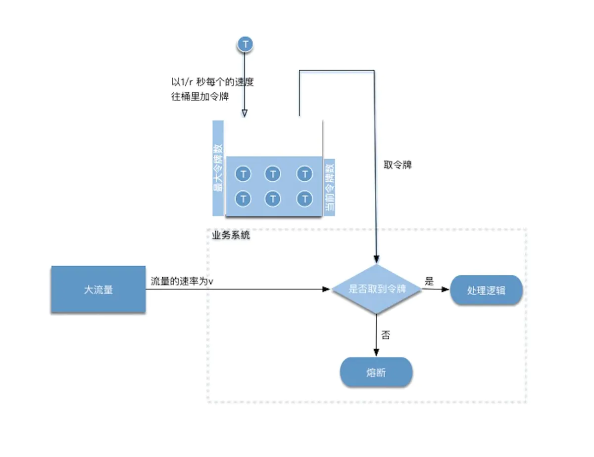

3. 【通过 `KeyResolver` 来指定限流的Key，比如我们需要根据用户来做限流，IP来做限流等等。】项目中设置限流的策略，创建 Config 类。这里根据用户ID限流，请求路径中必须携带 `userId` 参数。

```
@Bean
KeyResolver userKeyResolver() {
  return exchange -> Mono.just(exchange.getRequest().getQueryParams().getFirst("user"));
}
```

`KeyResolver` 需要实现 `resolve()` 方法，比如根据userid进行限流，则需要用userid去判断。实现完 `KeyResolver` 之后，需要将这个类的Bean注册到Ioc容器中。

**IP限流**

获取请求用户ip作为限流key。【如果需要根据IP限流，定义的获取限流Key的bean为：】

```
@Bean
public KeyResolver hostAddrKeyResolver() {
    return exchange -> Mono.just(exchange.getRequest().getRemoteAddress().getHostName());
}
```

通过exchange对象可以获取到请求信息，这边用了HostName。

**接口限流**

获取请求地址的uri作为限流key。【如果需要根据接口的URI进行限流，则需要获取请求地址的uri作为限流key，定义的Bean对象为：】

```
@Bean
KeyResolver apiKeyResolver() {
  return exchange -> Mono.just(exchange.getRequest().getPath().value());
}
```

或者

```
public class UriKeyResolver implements KeyResolver {

    @Override
    public Mono<String> resolve(ServerWebExchange exchange) {
        return Mono.just(exchange.getRequest().getURI().getPath());
    }

}
// 将这个类的Bean注册到Ioc容器中
@Bean
public UriKeyResolver uriKeyResolver() {
    return new UriKeyResolver();
}
```

**用户限流**

获取请求用户id作为限流key。

```
@Bean
public KeyResolver userKeyResolver() {
    return exchange -> Mono.just(exchange.getRequest().getQueryParams().getFirst("userId"));
}
```

4. 可以访问接口进行测试，这时候Redis中会有对应的数据

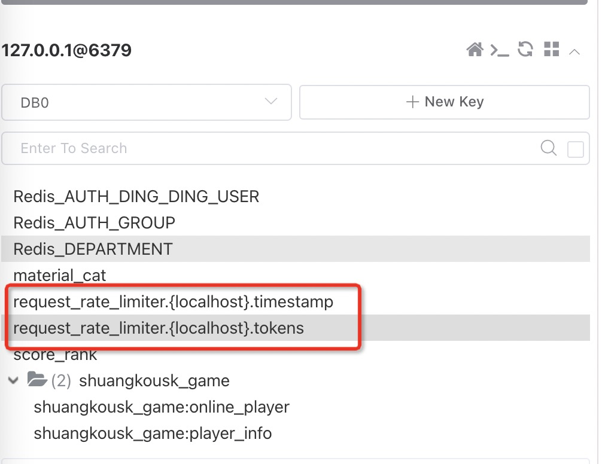

花括号中就是我们的限流Key,这边是IP，本地的就是localhost

*   timestamp:存储的是当前时间的秒数，也就是System.currentTimeMillis() / 1000或者Instant.now().getEpochSecond()
*   tokens:存储的是当前这秒钟的对应的可用的令牌数量

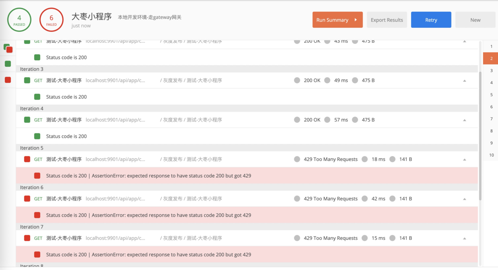

### 熔断降级

**为什么要实现熔断降级？**

在分布式系统中，网关作为流量的入口，大量请求进入网关，向后端远程系统或服务发起调用，后端服务不可避免的会产生调用失败（超时或者异常），失败时不能让请求堆积在网关上，需要快速失败并返回回去，这就需要在网关上做熔断、降级操作。

**为什么在网关上请求失败需要快速返回给客户端？**

因为当一个客户端请求发生故障的时候，这个请求会一直堆积在网关上，当然只有一个这种请求，网关肯定没有问题（如果一个请求就能造成整个系统瘫痪，那这个系统可以下架了），但是网关上堆积多了就会给网关乃至整个服务都造成巨大的压力，甚至整个服务宕掉。因此要对一些服务和页面进行有策略的降级，以此缓解服务器资源的的压力，以保证核心业务的正常运行，同时也保持了客户和大部分客户的得到正确的相应，所以需要网关上请求失败需要快速返回给客户端。

Spring Cloud Gateway 也可以利用 Hystrix 的熔断特性，在流量过大时进行服务降级，同样我们还是首先给项目添加上依赖。

1. `pom.xml`：

```yaml
<dependency>
  <groupId>org.springframework.cloud</groupId>
  <artifactId>spring-cloud-starter-netflix-hystrix</artifactId>
</dependency>
```

`application.yaml` 配置示例【不知道怎么用】：

```
spring:
  cloud:
    gateway:
      routes:
      - id: hystrix_route
        uri: http://example.org
        filters:
        - Hystrix=myCommandName
```

配置后，gateway 将使用 myCommandName 作为名称生成 HystrixCommand 对象来进行熔断管理。

2. `application.yaml` 如果想添加熔断后的回调内容，需要在添加一些配置。

```yaml
server.port: 8082

spring:
  application:
    name: gateway
  redis:
      host: localhost
      port: 6379
      password: 123456
  cloud:
    gateway:
      routes:
        - id: rateLimit_route
          uri: http://localhost:8000
          order: 0
          predicates:
            - Path=/test/**
          filters:
            - StripPrefix=1
            - name: Hystrix
              args:
                name: fallbackcmd # Hystrix的bean名称
                fallbackUri: forward:/incaseoffailureusethis # Hystrix超时降级后调用uri地址
  
# hystrix.command. fallbackcmd.execution.isolation.thread.timeoutInMilliseconds: 5000

# hystrix 信号量隔离，3秒后自动超时
hystrix:
  command:
    fallbackcmd:
      execution:
        isolation:
          strategy: SEMAPHORE
          thread:
            timeoutInMilliseconds: 3000
```

这里的配置，使用了两个过滤器：

（1）过滤器StripPrefix，作用是去掉请求路径的最前面n个部分截取掉。

StripPrefix=1就代表截取路径的个数为1，比如前端过来请求 `/test/good/1/view`，匹配成功后，路由到后端的请求路径就会变成http://localhost:8888/good/1/view。

（2）过滤器Hystrix，作用是通过Hystrix进行熔断降级

当上游的请求，进入了Hystrix熔断降级机制时，就会调用fallbackUri配置的降级地址。需要注意的是，还需要单独设置Hystrix的commandKey的超时时间。

fallbackUri 是发生熔断时回退的 URI 地址，目前只支持 forward 模式的 URI。如果服务被降级，该请求会被转发到该 URI 中。

3. `fallbackUri` 配置的降级地址的代码如下：

```
package org.gateway.controller;

import org.gateway.response.Response;
import org.springframework.web.bind.annotation.GetMapping;
import org.springframework.web.bind.annotation.RestController;

@RestController
public class FallbackController {

    @GetMapping("/fallbackA")
    public Response fallbackA() {
        Response response = new Response();
        response.setCode("100");
        response.setMessage("服务暂时不可用");
        return response;
    }
}
```

### 重试

RetryGatewayFilter是Spring Cloud Gateway对请求重试提供的一个GatewayFilter Factory。

```yaml
spring:
  cloud:
    gateway:
      routes:
      - id: test-service
        uri: lb://test
        predicates:
        - Path=/test/**
        filters:
        - StripPrefix= 1
        - name: Retry #重试
          args:
            retries: 1 #重试次数
            series: 
            - SERVER_ERROR
            statuses: BAD_GATEWAY,INTERNAL_SERVER_ERROR,SERVICE_UNAVAILABLE #500，502状态重试
            methods: GET,POST # 只有get和post接口重试
```

配置类源码：`org.springframework.cloud.gateway.filter.factory.RetryGatewayFilterFactory.RetryConfig`

```
    public static class RetryConfig implements HasRouteId {
        private String routeId;
        private int retries = 3;
        private List<Series> series;
        private List<HttpStatus> statuses;
        private List<HttpMethod> methods;
        private List<Class<? extends Throwable>> exceptions;
        private RetryGatewayFilterFactory.BackoffConfig backoff;

        public RetryConfig() {
            this.series = RetryGatewayFilterFactory.toList(Series.SERVER_ERROR);
            this.statuses = new ArrayList();
            this.methods = RetryGatewayFilterFactory.toList(HttpMethod.GET);
            this.exceptions = RetryGatewayFilterFactory.toList(IOException.class, TimeoutException.class);
        }

        public RetryGatewayFilterFactory.RetryConfig allMethods() {
            return this.setMethods(HttpMethod.values());
        }

        public void validate() {
            Assert.isTrue(this.retries > 0, "retries must be greater than 0");
            Assert.isTrue(!this.series.isEmpty() || !this.statuses.isEmpty() || !this.exceptions.isEmpty(), "series, status and exceptions may not all be empty");
            Assert.notEmpty(this.methods, "methods may not be empty");
            if (this.backoff != null) {
                this.backoff.validate();
            }

        }

        public RetryGatewayFilterFactory.BackoffConfig getBackoff() {
            return this.backoff;
        }

        public RetryGatewayFilterFactory.RetryConfig setBackoff(RetryGatewayFilterFactory.BackoffConfig backoff) {
            this.backoff = backoff;
            return this;
        }

        public RetryGatewayFilterFactory.RetryConfig setBackoff(Duration firstBackoff, Duration maxBackoff, int factor, boolean basedOnPreviousValue) {
            this.backoff = new RetryGatewayFilterFactory.BackoffConfig(firstBackoff, maxBackoff, factor, basedOnPreviousValue);
            return this;
        }

        public void setRouteId(String routeId) {
            this.routeId = routeId;
        }

        public String getRouteId() {
            return this.routeId;
        }

        public int getRetries() {
            return this.retries;
        }

        public RetryGatewayFilterFactory.RetryConfig setRetries(int retries) {
            this.retries = retries;
            return this;
        }

        public List<Series> getSeries() {
            return this.series;
        }

        public RetryGatewayFilterFactory.RetryConfig setSeries(Series... series) {
            this.series = Arrays.asList(series);
            return this;
        }

        public List<HttpStatus> getStatuses() {
            return this.statuses;
        }

        public RetryGatewayFilterFactory.RetryConfig setStatuses(HttpStatus... statuses) {
            this.statuses = Arrays.asList(statuses);
            return this;
        }

        public List<HttpMethod> getMethods() {
            return this.methods;
        }

        public RetryGatewayFilterFactory.RetryConfig setMethods(HttpMethod... methods) {
            this.methods = Arrays.asList(methods);
            return this;
        }

        public List<Class<? extends Throwable>> getExceptions() {
            return this.exceptions;
        }

        public RetryGatewayFilterFactory.RetryConfig setExceptions(Class<? extends Throwable>... exceptions) {
            this.exceptions = Arrays.asList(exceptions);
            return this;
        }
    }
```

- retries：重试次数，默认值是3次

- series：状态码配置（分段），符合的某段状态码才会进行重试逻辑，默认值是SERVER_ERROR，值是5，也就是5XX(5开头的状态码)，共有5个值：

```
public enum Series {
  INFORMATIONAL(1),
  SUCCESSFUL(2),
  REDIRECTION(3),
  CLIENT_ERROR(4),
  SERVER_ERROR(5);
}
```

- statuses：状态码配置，和series不同的是这边是具体状态码的配置

```
public enum HttpStatus {
    CONTINUE(100, "Continue"),
    SWITCHING_PROTOCOLS(101, "Switching Protocols"),
    PROCESSING(102, "Processing"),
    CHECKPOINT(103, "Checkpoint"),
    OK(200, "OK"),
    CREATED(201, "Created"),
    ACCEPTED(202, "Accepted"),
    NON_AUTHORITATIVE_INFORMATION(203, "Non-Authoritative Information"),
    NO_CONTENT(204, "No Content"),
    RESET_CONTENT(205, "Reset Content"),
    PARTIAL_CONTENT(206, "Partial Content"),
    MULTI_STATUS(207, "Multi-Status"),
    ALREADY_REPORTED(208, "Already Reported"),
    IM_USED(226, "IM Used"),
    MULTIPLE_CHOICES(300, "Multiple Choices"),
    MOVED_PERMANENTLY(301, "Moved Permanently"),
    FOUND(302, "Found"),
    /** @deprecated */
    @Deprecated
    MOVED_TEMPORARILY(302, "Moved Temporarily"),
    SEE_OTHER(303, "See Other"),
    NOT_MODIFIED(304, "Not Modified"),
    /** @deprecated */
    @Deprecated
    USE_PROXY(305, "Use Proxy"),
    TEMPORARY_REDIRECT(307, "Temporary Redirect"),
    PERMANENT_REDIRECT(308, "Permanent Redirect"),
    BAD_REQUEST(400, "Bad Request"),
    UNAUTHORIZED(401, "Unauthorized"),
    PAYMENT_REQUIRED(402, "Payment Required"),
    FORBIDDEN(403, "Forbidden"),
    NOT_FOUND(404, "Not Found"),
    METHOD_NOT_ALLOWED(405, "Method Not Allowed"),
    NOT_ACCEPTABLE(406, "Not Acceptable"),
    PROXY_AUTHENTICATION_REQUIRED(407, "Proxy Authentication Required"),
    REQUEST_TIMEOUT(408, "Request Timeout"),
    CONFLICT(409, "Conflict"),
    GONE(410, "Gone"),
    LENGTH_REQUIRED(411, "Length Required"),
    PRECONDITION_FAILED(412, "Precondition Failed"),
    PAYLOAD_TOO_LARGE(413, "Payload Too Large"),
    /** @deprecated */
    @Deprecated
    REQUEST_ENTITY_TOO_LARGE(413, "Request Entity Too Large"),
    URI_TOO_LONG(414, "URI Too Long"),
    /** @deprecated */
    @Deprecated
    REQUEST_URI_TOO_LONG(414, "Request-URI Too Long"),
    UNSUPPORTED_MEDIA_TYPE(415, "Unsupported Media Type"),
    REQUESTED_RANGE_NOT_SATISFIABLE(416, "Requested range not satisfiable"),
    EXPECTATION_FAILED(417, "Expectation Failed"),
    I_AM_A_TEAPOT(418, "I'm a teapot"),
    /** @deprecated */
    @Deprecated
    INSUFFICIENT_SPACE_ON_RESOURCE(419, "Insufficient Space On Resource"),
    /** @deprecated */
    @Deprecated
    METHOD_FAILURE(420, "Method Failure"),
    /** @deprecated */
    @Deprecated
    DESTINATION_LOCKED(421, "Destination Locked"),
    UNPROCESSABLE_ENTITY(422, "Unprocessable Entity"),
    LOCKED(423, "Locked"),
    FAILED_DEPENDENCY(424, "Failed Dependency"),
    UPGRADE_REQUIRED(426, "Upgrade Required"),
    PRECONDITION_REQUIRED(428, "Precondition Required"),
    TOO_MANY_REQUESTS(429, "Too Many Requests"),
    REQUEST_HEADER_FIELDS_TOO_LARGE(431, "Request Header Fields Too Large"),
    UNAVAILABLE_FOR_LEGAL_REASONS(451, "Unavailable For Legal Reasons"),
    INTERNAL_SERVER_ERROR(500, "Internal Server Error"),
    NOT_IMPLEMENTED(501, "Not Implemented"),
    BAD_GATEWAY(502, "Bad Gateway"),
    SERVICE_UNAVAILABLE(503, "Service Unavailable"),
    GATEWAY_TIMEOUT(504, "Gateway Timeout"),
    HTTP_VERSION_NOT_SUPPORTED(505, "HTTP Version not supported"),
    VARIANT_ALSO_NEGOTIATES(506, "Variant Also Negotiates"),
    INSUFFICIENT_STORAGE(507, "Insufficient Storage"),
    LOOP_DETECTED(508, "Loop Detected"),
    BANDWIDTH_LIMIT_EXCEEDED(509, "Bandwidth Limit Exceeded"),
    NOT_EXTENDED(510, "Not Extended"),
    NETWORK_AUTHENTICATION_REQUIRED(511, "Network Authentication Required");
}
```

- methods：指定哪些方法的请求需要进行重试逻辑，默认值是GET方法，取值如下：

```
public enum HttpMethod {
  GET, HEAD, POST, PUT, PATCH, DELETE, OPTIONS, TRACE;
}
```

- exceptions：指定哪些异常需要进行重试逻辑，默认值是`java.io.IOException`

**源码解析**

```
    public GatewayFilter apply(RetryGatewayFilterFactory.RetryConfig retryConfig) {
        // 验证重试配置格式是否正确
        retryConfig.validate();
        Repeat<ServerWebExchange> statusCodeRepeat = null;
        // 状态码配置不为空
        if (!retryConfig.getStatuses().isEmpty() || !retryConfig.getSeries().isEmpty()) {
            Predicate<RepeatContext<ServerWebExchange>> repeatPredicate = (context) -> {
                ServerWebExchange exchange = (ServerWebExchange)context.applicationContext();
                // 判断重试次数是否已经达到了配置的最大值
                if (this.exceedsMaxIterations(exchange, retryConfig)) {
                    return false;
                } else {
                    // 获取响应的状态码
                    HttpStatus statusCode = exchange.getResponse().getStatusCode();
                    // 判断响应状态码是否在配置中存在
                    boolean retryableStatusCode = retryConfig.getStatuses().contains(statusCode);
                    if (!retryableStatusCode && statusCode != null) {
                        retryableStatusCode = retryConfig.getSeries().stream().anyMatch((series) -> {
                            return statusCode.series().equals(series);
                        });
                    }

                    this.trace("retryableStatusCode: %b, statusCode %s, configured statuses %s, configured series %s", () -> {
                        return retryableStatusCode;
                    }, () -> {
                        return statusCode;
                    }, retryConfig::getStatuses, retryConfig::getSeries);
                    // 获取请求方法类型
                    HttpMethod httpMethod = exchange.getRequest().getMethod();
                    // 判断方法是否包含在配置中
                    boolean retryableMethod = retryConfig.getMethods().contains(httpMethod);
                    this.trace("retryableMethod: %b, httpMethod %s, configured methods %s", () -> {
                        return retryableMethod;
                    }, () -> {
                        return httpMethod;
                    }, retryConfig::getMethods);
                    // 决定是否要进行重试
                    return retryableMethod && retryableStatusCode;
                }
            };
            statusCodeRepeat = Repeat.onlyIf(repeatPredicate).doOnRepeat((context) -> {
                this.reset((ServerWebExchange)context.applicationContext());
            });
            RetryGatewayFilterFactory.BackoffConfig backoff = retryConfig.getBackoff();
            if (backoff != null) {
                statusCodeRepeat = statusCodeRepeat.backoff(this.getBackoff(backoff));
            }
        }

        Retry<ServerWebExchange> exceptionRetry = null;
        if (!retryConfig.getExceptions().isEmpty()) {
            Predicate<RetryContext<ServerWebExchange>> retryContextPredicate = (context) -> {
                if (this.exceedsMaxIterations((ServerWebExchange)context.applicationContext(), retryConfig)) {
                    return false;
                } else {
                    Throwable exception = context.exception();
                    Iterator var4 = retryConfig.getExceptions().iterator();

                    Class retryableClass;
                    do {
                        if (!var4.hasNext()) {
                            this.trace("exception or its cause is not retryable %s, configured exceptions %s", () -> {
                                return this.getExceptionNameWithCause(exception);
                            }, retryConfig::getExceptions);
                            return false;
                        }

                        retryableClass = (Class)var4.next();
                    } while(!retryableClass.isInstance(exception) && (exception == null || !retryableClass.isInstance(exception.getCause())));

                    this.trace("exception or its cause is retryable %s, configured exceptions %s", () -> {
                        return this.getExceptionNameWithCause(exception);
                    }, retryConfig::getExceptions);
                    return true;
                }
            };
            exceptionRetry = Retry.onlyIf(retryContextPredicate).doOnRetry((context) -> {
                this.reset((ServerWebExchange)context.applicationContext());
            }).retryMax((long)retryConfig.getRetries());
            RetryGatewayFilterFactory.BackoffConfig backoff = retryConfig.getBackoff();
            if (backoff != null) {
                exceptionRetry = exceptionRetry.backoff(this.getBackoff(backoff));
            }
        }

        final GatewayFilter gatewayFilter = this.apply(retryConfig.getRouteId(), statusCodeRepeat, exceptionRetry);
        return new GatewayFilter() {
            public Mono<Void> filter(ServerWebExchange exchange, GatewayFilterChain chain) {
                return gatewayFilter.filter(exchange, chain);
            }

            public String toString() {
                return GatewayToStringStyler.filterToStringCreator(RetryGatewayFilterFactory.this).append("retries", retryConfig.getRetries()).append("series", retryConfig.getSeries()).append("statuses", retryConfig.getStatuses()).append("methods", retryConfig.getMethods()).append("exceptions", retryConfig.getExceptions()).toString();
            }
        };
    }
```

```
    public GatewayFilter apply(String routeId, Repeat<ServerWebExchange> repeat, Retry<ServerWebExchange> retry) {
        if (routeId != null && this.getPublisher() != null) {
            this.getPublisher().publishEvent(new EnableBodyCachingEvent(this, routeId));
        }

        return (exchange, chain) -> {
            this.trace("Entering retry-filter");
            Publisher<Void> publisher = chain.filter(exchange).doOnSuccessOrError((aVoid, throwable) -> {
                // 获取已经重试的次数，默认值为-1
                int iteration = (Integer)exchange.getAttributeOrDefault("retry_iteration", -1);
                // 增加重试次数
                int newIteration = iteration + 1;
                this.trace("setting new iteration in attr %d", () -> {
                    return newIteration;
                });
                exchange.getAttributes().put("retry_iteration", newIteration);
            });
            if (retry != null) {
                publisher = ((Mono)publisher).retryWhen(retry.withApplicationContext(exchange));
            }

            if (repeat != null) {
                publisher = ((Mono)publisher).repeatWhen(repeat.withApplicationContext(exchange));
            }

            return Mono.fromDirect((Publisher)publisher);
        };
    }
```

#### 2. GlobalFilter

**参考资料**

[Spring Cloud Gateway-全局过滤器（Global Filters）](https://www.imooc.com/article/290821)

`GlobalFilter` 作用与 `GatewayFilter` 相同，但是针对所有路由配置生效，全局过滤链的执行顺序按照 `@Order` 注解指定的顺序。

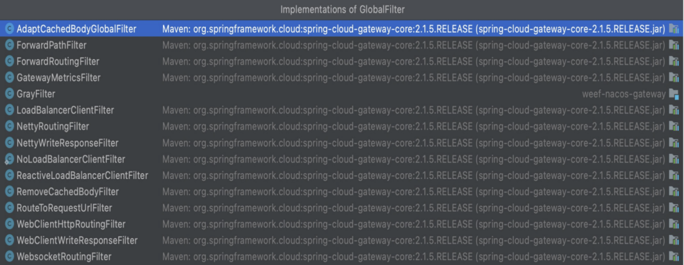

各个实现类的顺序如下（ **数值越小，优先级越高**，括号中为源码中的值 ）：

*   **AdaptCachedBodyGlobalFilter** ：**\-2147482648** （ Ordered.HIGHEST\_PRECEDENCE + 1000 ）
*   **ForwardPathFilter**：**0**
*   **ForwardRoutingFilter**：**2147483647** （ Ordered.LOWEST\_PRECEDENCE ）
*   **GatewayMetricsFilter**：**0**
*   **LoadBalancerClientFilter**：**10100**
*   **NettyRoutingFilter**：**2147483647** （ Ordered.LOWEST\_PRECEDENCE ）
*   **NettyWriteResponseFilter**：**\-1**
*   **RouteToRequestUrlFilter**：**10000**
*   **WebClientHttpRoutingFilter**：**2147483647** （ Ordered.LOWEST\_PRECEDENCE ）
*   **WebClientWriteResponseFilter**：**\-1**
*   **WebsocketRoutingFilter**：**2147483646** （ Ordered.LOWEST\_PRECEDENCE \- 1 ）

##### LoadBalancerClientFilter

`LoadBalancerClientFilter`，用于实现负载均衡的全局过滤器

```
spring:
  cloud:
    gateway:
      routes:
        - id: ${serviceId}
          uri: lb://example_service
```

URI 配置使用 `lb://` ，过滤器会识别到并将 example_service 名称解析成实际访问的主机和端口地址。

##### Websocket Routing Filter

如果exchange中的 `ServerWebExchangeUtils.GATEWAY_REQUEST_URL_ATTR` 属性的值的scheme是 `ws`或者 `wss` ，则运行Websocket Routing Filter。它底层使用Spring Web Socket将Websocket请求转发到下游。

> 如果你使用 [SockJS](https://github.com/sockjs) 所谓普通http的后备，则应配置正常的HTTP路由以及Websocket路由。

可为URI添加 `lb` 前缀实现负载均衡，例如 `lb:ws://serviceid` 。

*   作用： 使用`Spring Web Socket`的基础架构去转发`Websocket`请求
*   示例配置如下

```
spring:
  cloud:
    gateway:
      routes:
      # 一般的 Websocket 路由
      - id: websocket_route
        uri: ws://localhost:3001
        predicates:
        - Path=/websocket/**
      # SockJS 路由
      - id: websocket_sockjs_route
        uri: http://localhost:3001
        predicates:
        - Path=/websocket/info/**
```

*   当路由配置中`uri`所用的协议为`ws`或者`wss`时，Websocket 路由过滤器就会启用
*   可以通过这样的方式`lb:ws://serviceid`，以在使用websocket路由过滤器的时候同时使用负载均衡过滤器

##### Netty Routing Filter

*   当路由配置中`uri`所用的协议为`http`或者`https`时，netty 路由过滤器就会启用
*   作用：使用Netty的`HttpClient`转发请求给网关后面的服务。

##### 自定义 Filter

可以根据实际需求自定义过滤器，支持 GlobalFilter 和 GatewayFilter 两种

**自定义 GlobalFilter**

实现 GlobalFIlter 接口，框架会自动应用到所有的 Route，同时集成 Order 接口，指定执行顺序

```
@Component
public class SSOFilter implements GlobalFilter, Ordered {
    @Override
    public Mono<Void> filter(ServerWebExchange exchange, GatewayFilterChain chain) {
        // ...
    }

    @Override
    public int getOrder() {
        return Ordered.HIGHEST_PRECEDENCE;
    }	 
}
```

```
@Component
public class IpFilter implements GlobalFilter, Ordered {

    @Override
    public Mono<Void> filter(ServerWebExchange exchange, GatewayFilterChain chain) {
        //　如果在忽略的url里，则跳过
        String path = replacePrefix(exchange.getRequest().getURI().getPath());
        String requestUrl = exchange.getRequest().getURI().getRawPath();

        if (ignore(path) || ignore(requestUrl)) {
            return chain.filter(exchange);
        }
        // 验证token是否有效
        ServerHttpRequest request = exchange.getRequest();
        ServerHttpResponse response = exchange.getResponse();
        try {
            String token = request.getHeaders().getFirst("token");
            //没有token返回未认证
            if (token == null || token == "") {
                response.setStatusCode(HttpStatus.UNAUTHORIZED);
                return response.setComplete();
            }
            JWTUtils.verifyToken(token);
            return chain.filter(exchange);
        } catch (Exception e) {
            response.setStatusCode(HttpStatus.UNAUTHORIZED);
            return response.setComplete();
        }
    }

    private boolean ignore(String path) {
        return Arrays.stream(IGNOREURL).map(url -> url.replace("/**", "")).anyMatch(path::startsWith);
    }

    @Override
    public int getOrder() {
        return 1;
    }
}
```

**自定义 GatewayFilter**

首先需要继承 AbstractGatewayFilterFactory

```

@Service
public class XXXGatewayFilterFactory extends AbstractGatewayFilterFactory<XXXConfig> {
  
    @Override
    public GatewayFilter apply(final XXXConfig config) {
        return (((exchange, chain) -> {
            return chain.filter(exchange).then(Mono.fromRunnable(() -> {
                // ...
            }));
        }));
    }

    @Data
    public static class XXXConfig {

        private String name;
    }
}
```

需要注意的是：

*   类名必须以 GatewayFilterFactory 结尾，过滤器名字使用类名前缀

*   `apply` 方法中，`chain.filter()` 为 Pre 过滤，`then()` 为 Post 过滤

*   配置类属性可以再 yml 中配置

*   该类需要注入到 IoC 容器

```yaml
spring:
  cloud:
    gateway:
      routes:
        - id: ${serviceId}
          filter:
            - name: XXX
              args: 
                name: ${name}
```

## 基本组件源码介绍

### 1. Route

表示一个具体的路由信息载体。

`Route`源代码：

```
package org.springframework.cloud.gateway.route;

public class Route implements Ordered {
    private final String id; // ①
    private final URI uri; // ②
    private final int order; // ③
    private final AsyncPredicate<ServerWebExchange> predicate; // ④
    private final List<GatewayFilter> gatewayFilters; // ⑤

    private Route(String id, URI uri, int order, AsyncPredicate<ServerWebExchange> predicate, List<GatewayFilter> gatewayFilters) {
        this.id = id;
        this.uri = uri;
        this.order = order;
        this.predicate = predicate;
        this.gatewayFilters = gatewayFilters;
    }
}
```

Route 主要定义了如下几个部分：

① **id**，标识符，区别于其他 Route。

② **destination uri**，路由指向的目的地 uri，即客户端请求最终被转发的目的地。

③ **order**，用于多个 Route 之间的排序，数值越小排序越靠前，匹配优先级越高。

④ **predicate**，谓语，表示匹配该 Route 的前置条件，即满足相应的条件才会被路由到目的地 uri。

⑤ **gateway filters**，过滤器用于处理切面逻辑，如路由转发前修改请求头等。

### 2. AsyncPredicate

`AsyncPredicate`源代码：

```
public interface AsyncPredicate<T> extends Function<T, Publisher<Boolean>> {
    default AsyncPredicate<T> and(AsyncPredicate<? super T> other) { // ①
        return new AsyncPredicate.AndAsyncPredicate(this, other);
    }

    default AsyncPredicate<T> negate() { // ②
        return new AsyncPredicate.NegateAsyncPredicate(this);
    }

    default AsyncPredicate<T> or(AsyncPredicate<? super T> other) { // ③
        return new AsyncPredicate.OrAsyncPredicate(this, other);
    }

    public static class AndAsyncPredicate<T> implements AsyncPredicate<T> {
        private final AsyncPredicate<? super T> left;
        private final AsyncPredicate<? super T> right;

        public AndAsyncPredicate(AsyncPredicate<? super T> left, AsyncPredicate<? super T> right) {
            Assert.notNull(left, "Left AsyncPredicate must not be null");
            Assert.notNull(right, "Right AsyncPredicate must not be null");
            this.left = left;
            this.right = right;
        }

        public Publisher<Boolean> apply(T t) {
            return Flux.zip((Publisher)this.left.apply(t), (Publisher)this.right.apply(t)).map((tuple) -> {
                return (Boolean)tuple.getT1() && (Boolean)tuple.getT2();
            });
        }

        public String toString() {
            return String.format("(%s && %s)", this.left, this.right);
        }
    }

    public static class NegateAsyncPredicate<T> implements AsyncPredicate<T> {
        private final AsyncPredicate<? super T> predicate;

        public NegateAsyncPredicate(AsyncPredicate<? super T> predicate) {
            Assert.notNull(predicate, "predicate AsyncPredicate must not be null");
            this.predicate = predicate;
        }

        public Publisher<Boolean> apply(T t) {
            return Mono.from((Publisher)this.predicate.apply(t)).map((b) -> {
                return !b;
            });
        }

        public String toString() {
            return String.format("!%s", this.predicate);
        }
    }

    public static class OrAsyncPredicate<T> implements AsyncPredicate<T> {
        private final AsyncPredicate<? super T> left;
        private final AsyncPredicate<? super T> right;

        public OrAsyncPredicate(AsyncPredicate<? super T> left, AsyncPredicate<? super T> right) {
            Assert.notNull(left, "Left AsyncPredicate must not be null");
            Assert.notNull(right, "Right AsyncPredicate must not be null");
            this.left = left;
            this.right = right;
        }

        public Publisher<Boolean> apply(T t) {
            return Flux.zip((Publisher)this.left.apply(t), (Publisher)this.right.apply(t)).map((tuple) -> {
                return (Boolean)tuple.getT1() || (Boolean)tuple.getT2();
            });
        }

        public String toString() {
            return String.format("(%s || %s)", this.left, this.right);
        }
    }
}
```

AsyncPredicate 定义了 3 种逻辑操作方法：

① **and** ，与操作，即两个 Predicate 组成一个，需要同时满足。

② **negate**，取反操作，即对 Predicate 匹配结果取反。

③ **or**，或操作，即两个 Predicate 组成一个，只需满足其一。

### GatewayFilter

`GatewayFilter` 源代码：

```
public interface GatewayFilter extends ShortcutConfigurable {
    String NAME_KEY = "name";
    String VALUE_KEY = "value";

    Mono<Void> filter(ServerWebExchange exchange, GatewayFilterChain chain);
}
```

Filter 最终是通过 filter chain 来形成链式调用的，每个 filter 处理完 pre filter 逻辑后委派给 filter chain，filter chain 再委派给下一下 filter。

`GatewayFilterChain` 源代码：

```
public interface GatewayFilterChain {
    Mono<Void> filter(ServerWebExchange exchange);
}
```

## Route 构建的原理

外部化配置是如何工作的？

Spring boot 遵循规约大于配置的原则，starter 模块都有对应的以模块名称作前缀，以 “AutoConfiguration” 后缀的自动装配类。同样的还有以模块名前缀，以`Properties`后缀的配置类作为支持。

Gateway 模块自动装配类为 GatewayAutoConfiguration，对应的配置类为 GatewayProperties。

### 1. GatewayProperties

GatewayProperties 是 Spring cloud gateway 模块提供的外部化配置类。

```
package org.springframework.cloud.gateway.config;

@ConfigurationProperties("spring.cloud.gateway") // ①
@Validated
public class GatewayProperties {
    private final Log logger = LogFactory.getLog(this.getClass());
    @NotNull
    @Valid
    private List<RouteDefinition> routes = new ArrayList(); // ②
    private List<FilterDefinition> defaultFilters = new ArrayList(); // ③
    private List<MediaType> streamingMediaTypes;
}
```

① 表明以 “spring.cloud.gateway” 前缀的 properties 会绑定 GatewayProperties。

② 用来对 Route 进行定义。

③ 用于定义默认的 Filter 列表，默认的 Filter 会应用到每一个 Route 上，gateway 处理时会将其与 Route 中指定的 Filter 进行合并后并逐个执行。

### 2. RouteDefinition

顾名思义，该组件用来对 Route 信息进行定义，最终会被 RouteLocator 解析成 Route。【RouteDefinition 对 Route 信息进行定义，最终会被 RouteLocator 解析成 Route（类似 BeanDefinition 和 Bean 的关系），FilterDefinition 和 PredicateDefinition 同理。】

```
@Validated
public class RouteDefinition {
    private String id; // ①
    @NotEmpty
    @Valid
    private List<PredicateDefinition> predicates = new ArrayList(); // ②
    @Valid
    private List<FilterDefinition> filters = new ArrayList(); // ③
    @NotNull
    private URI uri; // ④
    private int order = 0; // ⑤
}
```

① 定义 Route 的 id。

② 定义 Predicate。

③ 定义 Filter。

④ 定义目的地 URI。

⑤ 定义 Route 的序号。

可见，RouteDefinition 中所定义的属性与 Route 本身是一一对应的。

### 3. FilterDefinition

同样遵循组件名前缀 + `Definition` 后缀的命名规范，用于定义 Filter。

```
@Validated
public class FilterDefinition {
    @NotNull
    private String name; // ①
    private Map<String, String> args = new LinkedHashMap(); // ②
}
```

① 定义了 Filter 的名称，符合特定的命名规范，为对应的工厂名前缀。

② 一个键值对参数用于构造 Filter 对象。

#### 外部配置到 FilterDefinition 对象绑定

以 `AddRequestHeaderGatewayFilterFactory` 为例:

```yaml
spring:
  cloud:
    gateway:
      routes:
      - id: add_request_header_route
        uri: http://example.org
        filters:
        - AddRequestHeader=X-Request-Foo, Bar # ①
```

① 这一行配置被 spring 解析后会绑定到一个 FilterDefinition 对象。

**AddRequestHeader** ，对应 FilterDefinition 中的 `name` 属性。`AddRequestHeader`为`AddRequestHeaderGatewayFilterFactory` 的类名前缀。

**X-Request-Foo, Bar** ，会被解析成 FilterDefinition 中的 Map 类型属性 `args`。此处会被解析成两组键值对，以英文逗号将`=`后面的字符串分隔成数组，`key`是固定字符串 `_genkey_` + 数组元素下标，`value`为数组元素自身。

相关源码：

```
// FilterDefinition 构造函数
public FilterDefinition(String text) {
    // ASCII码为=
    int eqIdx = text.indexOf(61);
    if (eqIdx <= 0) {
        this.setName(text);
    } else {
        this.setName(text.substring(0, eqIdx));
        String[] args = StringUtils.tokenizeToStringArray(text.substring(eqIdx + 1), ",");

        for(int i = 0; i < args.length; ++i) {
            this.args.put(NameUtils.generateName(i), args[i]); // ①
        }

    }
}

// ① 使用到的工具类 NameUtils 源码
public final class NameUtils {
    public static final String GENERATED_NAME_PREFIX = "_genkey_";

    private NameUtils() {
        throw new AssertionError("Must not instantiate utility class.");
    }

    public static String generateName(int i) {
        return "_genkey_" + i;
    }
    // ......
}
```

### 4. PredicateDefinition

同样遵循组件名前缀 + `Definition` 后缀的命名规范，用于定义 Predicate。

```
public class PredicateDefinition {
    @NotNull
    private String name; // ①
    private Map<String, String> args = new LinkedHashMap(); // ②

}
```

① 定义了 Predicate 的名称，它们要符固定的命名规范，为对应的工厂名称。

② 一个 Map 类型的参数，构造 Predicate 使用到的键值对参数。

外部化配置绑定到 PredicateDefinition 源码逻辑与 FilterDefinition 类似，不再赘述。

### 5. RoutePredicateFactory

RoutePredicateFactory 是所有 predicate factory 的顶级接口，职责就是生产 Predicate。

创建一个用于配置用途的对象（config），以其作为参数应用到 `apply`方法上来生产一个 Predicate 对象，再将 Predicate 对象包装成 AsyncPredicate。

```
@FunctionalInterface // ①
public interface RoutePredicateFactory<C> extends ShortcutConfigurable, Configurable<C> { // ④
    String PATTERN_KEY = "pattern";

    default Predicate<ServerWebExchange> apply(Consumer<C> consumer) { // ②
        C config = this.newConfig();
        consumer.accept(config);
        this.beforeApply(config);
        return this.apply(config);
    }

    default AsyncPredicate<ServerWebExchange> applyAsync(Consumer<C> consumer) { // ③
        C config = this.newConfig();
        consumer.accept(config);
        this.beforeApply(config);
        return this.applyAsync(config);
    }
}

// RoutePredicateFactory 继承了 Configurable
public interface Configurable<C> {
    Class<C> getConfigClass(); // ⑤

    C newConfig(); // ⑥
}
```

① 声明它是一个函数接口。

② 核心方法，即函数接口的唯一抽象方法，用于生产 Predicate，接收一个范型参数 config。

③ 对参数 config 应用工厂方法，并将返回结果 Predicate 包装成 AsyncPredicate。包装成 AsyncPredicate 是为了使用非阻塞模型。

④ 扩展了 Configurable 接口，从命名上可以推断 Predicate 工厂是支持配置的。

⑤ 获取配置类的类型，支持范型，具体的 config 类型由子类指定。

⑥ 创建一个 config 实例，由具体的实现类来完成。

### 6. GatewayFilterFactory

GatewayFilterFactory 职责就是生产 GatewayFilter。

```
@FunctionalInterface
public interface GatewayFilterFactory<C> extends ShortcutConfigurable, Configurable<C> { // ①
    String NAME_KEY = "name";
    String VALUE_KEY = "value";

    GatewayFilter apply(C config); // ②
}
```

① 同样继承了 ShortcutConfigurable 和 Configurable 接口，支持配置。

② 核心方法，用于生产 GatewayFilter，接收一个范型参数 config 。

### 7. Predicate 示例由浅入深

以 `AfterRoutePredicateFactory` 为例：

它匹配当前日期时间之后产生的请求，仅需要提供一个时间参数。

```yaml
spring:
  cloud:
    gateway:
      routes:
      - id: after_route
        uri: http://example.org
        predicates:
        - After=2017-01-20T17:42:47.789-07:00[America/Denver] # ①
```

仅匹配发生在 2017-01-20 17:42 北美山区时区 (Denver) 之后的请求。

① 结合上文内容，可得知这一行配置会被绑定至 `PredicateDefinition` 对象，将其可视化：

```
// 可将下面内容想象成 PredicateDefinition 对象 toString() 方法返回结果
PredicateDefinition {
    name='After',
    args={_genkey_0=2017-01-20T17:42:47.789-07:00[America/Denver]}
}
```

`AfterRoutePredicateFactory` 源码：

```
public class AfterRoutePredicateFactory extends AbstractRoutePredicateFactory<AfterRoutePredicateFactory.Config> { // ①
    public static final String DATETIME_KEY = "datetime";

    public AfterRoutePredicateFactory() {
        super(AfterRoutePredicateFactory.Config.class);
    }

    public List<String> shortcutFieldOrder() {
        return Collections.singletonList("datetime");
    }

    public Predicate<ServerWebExchange> apply(AfterRoutePredicateFactory.Config config) { // ②
        return new GatewayPredicate() {
            public boolean test(ServerWebExchange serverWebExchange) {
                ZonedDateTime now = ZonedDateTime.now();
                return now.isAfter(config.getDatetime());
            }

            public String toString() {
                return String.format("After: %s", config.getDatetime());
            }
        };
    }

    public static class Config { // ③
        @NotNull
        private ZonedDateTime datetime;

        public Config() {
        }

        public ZonedDateTime getDatetime() {
            return this.datetime;
        }

        public void setDatetime(ZonedDateTime datetime) {
            this.datetime = datetime;
        }
    }
}
```
① 声明了范型，即使用到的配置类为 AfterRoutePredicateFactory 中定义的内部类 Config。

② 生产 Predicate 对象，逻辑是判断当前时间（执行时）是否在 Config 中指定的 `datetime`之后。

③ 该配置类只包含一个`datetime`时间字符串属性。

**疑问**：`PredicateDefinition` 对象又是如何转换成 `AfterRoutePredicateFactory.Config` 对象的？

至此，还是没有说明是如何转换的，这要涉及 `RouteLocator` 组件。

### 8. RouteLocator

从名称上来推断是 Route 的定位器或者说探测器，是用来获取 Route 信息的。【用于获取 Route，通过 RouteDefinitionLocator 获取到 RouteDefinition，然后转换成 Route】

```
public interface RouteLocator {
    Flux<Route> getRoutes(); // ①
}
```

① 源码传达的含义十分简单，获取 Route。

外部化配置定义 Route 使用的是 `RouteDefinition` 组件。同样的也有配套的 `RouteDefinitionLocator` 组件。

```
public interface RouteDefinitionLocator {
    Flux<RouteDefinition> getRouteDefinitions(); // ①
}
```

① 源码也很简单，其职责是获取 RouteDefinition。

### 9. RouteDefinitionRouteLocator

RouteLocator 最主要的实现类，用于将 RouteDefinition 转换成 Route。

#### 9.1 构造函数

```
public class RouteDefinitionRouteLocator implements RouteLocator, BeanFactoryAware, ApplicationEventPublisherAware {
    public static final String DEFAULT_FILTERS = "defaultFilters";
    protected final Log logger = LogFactory.getLog(this.getClass());
    private final RouteDefinitionLocator routeDefinitionLocator;
    private final ConversionService conversionService;
    private final Map<String, RoutePredicateFactory> predicates = new LinkedHashMap();
    private final Map<String, GatewayFilterFactory> gatewayFilterFactories = new HashMap();
    private final GatewayProperties gatewayProperties;
    private final SpelExpressionParser parser = new SpelExpressionParser();
    private BeanFactory beanFactory;
    private ApplicationEventPublisher publisher;
    @Autowired
    private Validator validator;

    public RouteDefinitionRouteLocator(RouteDefinitionLocator routeDefinitionLocator, List<RoutePredicateFactory> predicates, List<GatewayFilterFactory> gatewayFilterFactories, GatewayProperties gatewayProperties, ConversionService conversionService) {
        this.routeDefinitionLocator = routeDefinitionLocator;
        this.conversionService = conversionService;
        this.initFactories(predicates);
        gatewayFilterFactories.forEach((factory) -> {
            GatewayFilterFactory var10000 = (GatewayFilterFactory)this.gatewayFilterFactories.put(factory.name(), factory);
        });
        this.gatewayProperties = gatewayProperties;
    }
}
```

**参数1:** **RouteDefinition Locator**，一个 RouteDefinitionLocator 对象。

**参数2:** **predicates factories**，Predicate 工厂列表，会被映射成 `key` 为 name, `value` 为 factory 的 Map。可以猜想出 gateway 是如何根据 PredicateDefinition 中定义的 `name` 来匹配到相对应的 factory 了。

**参数3:** **filter factories**，Gateway Filter 工厂列表，同样会被映射成 `key` 为 name, `value` 为 factory 的 Map。

**参数4:** **gateway properties**，外部化配置类。

**疑问**：该类依赖 GatewayProperties 对象，后者已经携带了 List 结构的 RouteDefinition，那为什么还要依赖 RouteDefinitionLocator 来提供 RouteDefinition？

1.  这里并不会直接使用到 GatewayProperties 类中的 RouteDefinition，仅是用到其定义的 default filters，这会应用到每一个 Route 上。
2.  最终传入的 RouteDefinitionLocator 实现上是 CompositeRouteDefinitionLocator 的实例，它组合了 GatewayProperties 中所定义的 routes。

自动装配类 `GatewayAutoConfiguration` 中的定义：

```
    @Bean
    @ConditionalOnMissingBean
    public PropertiesRouteDefinitionLocator propertiesRouteDefinitionLocator(GatewayProperties properties) {
        return new PropertiesRouteDefinitionLocator(properties); // ①
    }

    @Bean
    @Primary // ③
    public RouteDefinitionLocator routeDefinitionLocator(List<RouteDefinitionLocator> routeDefinitionLocators) { // ②
        return new CompositeRouteDefinitionLocator(Flux.fromIterable(routeDefinitionLocators));
    }
```

① RouteDefinitionLocator 的实现类，RouteDefinition 信息来自 GatewayProperties。

② 声明 bean`routeDefinitionLocator`，使用 CompositeRouteDefinitionLocator 实现，它组合了多个 RouteDefinitionLocator 实例。这给用户（开发者）提供了可扩展的余地，用户可以根据需要扩展自己的 RouteDefinitionLocator，比如 RouteDefinition 可源自数据库。

#### 9.2 核心方法

`getRoutes` 源码：

```
    // 实现 RouteLocator 的 getRoutes() 方法
    public Flux<Route> getRoutes() {
        return this.routeDefinitionLocator.getRouteDefinitions().map(this::convertToRoute).map((route) -> { // ①
            if (this.logger.isDebugEnabled()) {
                this.logger.debug("RouteDefinition matched: " + route.getId());
            }

            return route;
        });
    }

    // ① 所调用的方法
    private Route convertToRoute(RouteDefinition routeDefinition) {
        AsyncPredicate<ServerWebExchange> predicate = this.combinePredicates(routeDefinition); // ②
        List<GatewayFilter> gatewayFilters = this.getFilters(routeDefinition); // ③
        return ((AsyncBuilder)Route.async(routeDefinition)// ④
.asyncPredicate(predicate).replaceFilters(gatewayFilters)).build();
    }
```

① 调用 convertToRoute 方法将 RouteDefinition 转换成 Route。

② 将 PredicateDefinition 转换成 AsyncPredicate。

③ 将 FilterDefinition 转换成 GatewayFilter。

④ 根据 ② 和 ③ 两步骤定义的变量生成 Route 对象。

#### 9.3 PredicateDefinition 转换成 AsyncPredicate

```
    private AsyncPredicate<ServerWebExchange> combinePredicates(RouteDefinition routeDefinition) {
        List<PredicateDefinition> predicates = routeDefinition.getPredicates();
        AsyncPredicate<ServerWebExchange> predicate = this.lookup(routeDefinition, (PredicateDefinition)predicates.get(0)); // ①

        AsyncPredicate found;
        for(Iterator var4 = predicates.subList(1, predicates.size()).iterator(); var4.hasNext(); predicate = predicate.and(found)) // ③ 
        {
            PredicateDefinition andPredicate = (PredicateDefinition)var4.next();
            found = this.lookup(routeDefinition, andPredicate); // ②
        }

        return predicate;
    }
```

① 调用 `lookup` 方法，将列表中第一个 `PredicateDefinition` 转换成 `AsyncPredicate` 。

② 循环调用，将列表中每一个 `PredicateDefinition` 都转换成 `AsyncPredicate` 。

③ 应用`and`操作，将所有的 AsyncPredicate 组合成一个 AsyncPredicate 对象。

具体的转换逻辑：

```
    private AsyncPredicate<ServerWebExchange> lookup(RouteDefinition route, PredicateDefinition predicate) {
        RoutePredicateFactory<Object> factory = (RoutePredicateFactory)this.predicates.get(predicate.getName()); // ①
        if (factory == null) {
            throw new IllegalArgumentException("Unable to find RoutePredicateFactory with name " + predicate.getName());
        } else {
            Map<String, String> args = predicate.getArgs(); // ②
            if (this.logger.isDebugEnabled()) {
                this.logger.debug("RouteDefinition " + route.getId() + " applying " + args + " to " + predicate.getName());
            }

            Map<String, Object> properties = factory.shortcutType().normalize(args, factory, this.parser, this.beanFactory); // ③
            Object config = factory.newConfig(); // ④
            ConfigurationUtils.bind(config, properties, factory.shortcutFieldPrefix(), predicate.getName(), this.validator, this.conversionService); // ⑤
            if (this.publisher != null) {
                this.publisher.publishEvent(new PredicateArgsEvent(this, route.getId(), properties));
            }

            return factory.applyAsync(config); // ⑥
        }
    }
```

① 根据 predicate 名称获取对应的 predicate factory。

② 获取 PredicateDefinition 中的 Map 类型参数，`key` 是固定字符串`_genkey_` + 数字拼接而成。

③ 对第 ② 步获得的参数作进一步转换，`key`为 config 类（工厂类中通过范型指定）的属性名称。

④ 调用 factory 的 newConfig 方法创建一个 config 类对象。

⑤ 将第 ③ 步中产生的参数绑定到 config 对象上。

⑥ 将 cofing 作参数代入，调用 factory 的 applyAsync 方法创建 AsyncPredicate 对象。

#### 9.4 FilterDefinition 转换成 GatewayFilter

```
    private List<GatewayFilter> getFilters(RouteDefinition routeDefinition) {
        List<GatewayFilter> filters = new ArrayList();
        if (!this.gatewayProperties.getDefaultFilters().isEmpty()) { // ①
            filters.addAll(this.loadGatewayFilters("defaultFilters", this.gatewayProperties.getDefaultFilters()));
        }

        if (!routeDefinition.getFilters().isEmpty()) { // ②
            filters.addAll(this.loadGatewayFilters(routeDefinition.getId(), routeDefinition.getFilters()));
        }

        AnnotationAwareOrderComparator.sort(filters); // ③
        return filters;
    }
```

① 处理 GatewayProperties 中定义的默认的 FilterDefinition，转换成 GatewayFilter。

② 将 RouteDefinition 中定义的 FilterDefinition 转换成 GatewayFilter。

③ 对 GatewayFilter 进行排序，排序的详细逻辑请查阅 spring 中的 `Ordered` 接口。

根据名称获取对应的 filter factory，生成 config 对象，绑定属性，调用工厂方法产生 GatewayFilter 对象。

**小结**

主要涉及以下概念：

*   Route

    路由信息，包含 destination uri、predicate 和 filter。

*   AsyncPredicate

    匹配相应的 Predicate 才能被路由。

*   GatewayFilter

    请求转发至下游服务前后的业务逻辑链。

*   GatewayProperties

    外部化配置类，配置路由信息。

*   RoutePredicateFactory

    Predicate 工厂，用于生产 Predicate。

*   GatewayFilterFactory

    GatewayFilter 工厂，用于生产 GatewayFilter。

*   RouteDefinitionRouteLocator

    RouteLocator 接口核心实现类，用于将 RouteDefinition 转换成 Route。

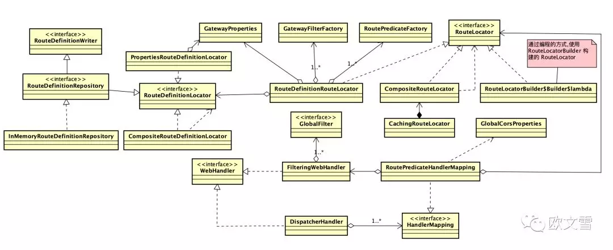

## CORS跨域处理

现在的请求通过经过Gateway网关时，需要在网关统一配置跨域请求，需求所有请求通过

```yaml
spring:
  cloud:
    gateway:
      globalcors:
        cors-configurations:
          '[/**]':
            allowed-origins: "*"
            allowed-headers: "*"
            allow-credentials: true
            allowed-methods:
              - GET
              - POST
              - DELETE
              - PUT
              - OPTION
```

## 负载均衡

```yaml
spring:
  cloud:
    gateway:
      discovery:
        locator:
          enabled: true # 启用自动根据服务ID生成路由
          lower-case-service-id: true # 设置路由的路径为小写的服务ID
      routes:
        - id: sso-service # 路由ID（一个路由配置一个ID）
          uri: lb://sso # 通过注册中心来查找服务（lb代表从注册中心获取服务，并且自动开启负载均衡）
          predicates:
            - Path=/auth/** # 匹配到的以/product开头的路径都转发到product的服务，相当于访问 lb://PRODUCT-SERVICE/**
          filters:
            - StripPrefix=1 # 去掉匹配到的路径的第一段
```

**`LoadBalancerClientFilter` **：实现负载均衡的**全局**过滤器，内部实现是ribbon?