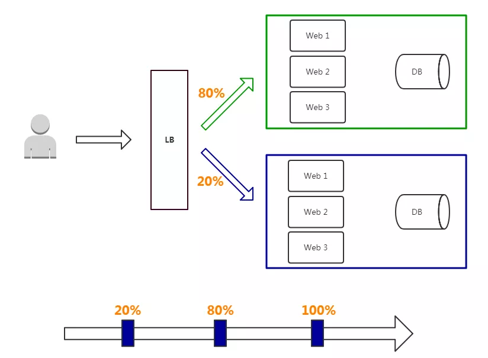

## 灰度发布

灰度发布（又名金丝雀发布）是指在黑与白之间，能够平滑过渡的一种发布方式。在其上可以进行A/B testing，即让一部分用户继续用软件应用特性A，一部分用户开始用软件应用特性B，如果用户对B没有什么反对意见，那么逐步扩大范围，把所有用户都迁移到B上面来。灰度发布可以保证整体系统的稳定，在初始灰度的时候就可以发现、调整问题，以保证其影响度。

> 矿井中的金丝雀
> 17 世纪，英国矿井工人发现，金丝雀对瓦斯这种气体十分敏感。空气中哪怕有极其微量的瓦斯，金丝雀也会停止歌唱；而当瓦斯含量超过一定限度时，虽然鲁钝的人类毫无察觉，金丝雀却早已毒发身亡。当时在采矿设备相对简陋的条件下，工人们每次下井都会带上一只金丝雀作为 “瓦斯检测指标”，以便在危险状况下紧急撤离。

**特点：**

- 保证整体系统稳定性，在初始灰度的时候就可以发现、调整问题，影响范围可控；

- 新功能逐步评估性能，稳定性和健康状况，如果出问题影响范围很小，相对用户体验也少；
- 用户无感知，平滑过渡。

**缺点：**

- 自动化要求高

**部署过程：**

- 从LB摘掉灰度服务器，升级成功后再加入LB；

- 少量用户流量到新版本；
- 如果灰度服务器测试成功，升级剩余服务器。

灰度发布是通过切换线上并存版本之间的路由权重，逐步从一个版本切换为另一个版本的过程。

#### A/B Testing

A/B测试是用来测试应用功能表现的方法，例如可用性、受欢迎程度、可见性等等。A/B测试通常用在应用的前端上，不过当然需要后端来支持。

A/B测试与蓝绿部署的区别在于，A/B测试目的在于通过科学的实验设计、采样样本代表性、流量分割与小流量测试等方式来获得具有代表性的实验结论，并确信该结论在推广到全部流量可信；蓝绿部署的目的是安全稳定地发布新版本应用，并在必要时回滚。

A/B测试和蓝绿部署可以同时使用。

### 灰度发布的原理

灰度发布的原理其实就是对请求进行分流，可以让指定的用户访问指定的具有新功能的服务，其他的用户还是使用老的服务。既然是对请求进行分流，那么这个还是可以在 API 网关中统一处理，网关是对外的入口，当用户的请求过来时，我们可以将特定的用户请求转发到我们刚刚发布好的具有新功能的服务上去。

在灰度发布开始后，先启动一个新版本应用，但是并不直接将流量切过来，而是测试人员对新版本进行线上测试，启动的这个新版本应用，就是我们的金丝雀。如果没有问题，那么可以将少量的用户流量导入到新版本上，然后再对新版本做运行状态观察，收集各种运行时数据，如果此时对新旧版本做各种数据对比，就是所谓的A/B测试。

当确认新版本运行良好后，再逐步将更多的流量导入到新版本上，在此期间，还可以不断地调整新旧两个版本的运行的服务器副本数量，以使得新版本能够承受越来越大的流量压力。直到将100%的流量都切换到新版本上，最后关闭剩下的老版本服务，完成灰度发布。

如果在灰度发布过程中（灰度期）发现了新版本有问题，就应该立即将流量切回老版本上，这样，就会将负面影响控制在最小范围内。

### 灰度发布的实现策略

1. 根据用户ID做灰度发布
2. 根据IP做灰度发布
3. 根据cookie进行灰度
4. 灰度策略还可以从request patameter, request header等方面进行

## 蓝绿发布

所谓蓝绿部署，是指同时运行两个版本的应用，蓝绿部署的时候，并不停止掉老版本，而是直接部署一套新版本，等新版本运行起来后，再将流量切换到新版本上。但是蓝绿部署要求在升级过程中，同时运行两套程序，对硬件的要求就是日常所需的二倍，比如日常运行时，需要10台服务器支撑业务，那么使用蓝绿部署，你就需要购置二十台服务器。

正常将项目分为两组, 蓝组和绿组, 正常运转的情况下每组承载 `50%` 的流量. 当准备发布服务时, 将蓝组流量设置为0%, 将绿组空闲出来, 将服务部署到绿组的机器, 然后利用`SLB`将流量切换到绿组的机器, 让绿组来运行业务, 没问题的话流量全部导向绿组, 把蓝组也进行服务更新。

**部署过程：**

项目逻辑上分为AB组，在项目部署时，首先把A组从负载均衡中摘除，进行新版本的部署。B组仍然继续提供服务。

当A组升级完毕，负载均衡重新接入A组，再把B组从负载列表中摘除，进行新版本的部署。A组重新提供服务。

最后，B组也升级完成，负载均衡重新接入B组，此时，AB组版本都已经升级完成，并且都对外提供服务。

**特点：**

- 如果出问题，影响范围较大；

- 发布策略简单；
- 用户无感知，平滑过渡；
- 升级/回滚速度快。只需要更改路由或者切换DNS服务器，效率较高
- 更新过程无需停机，风险较少

**缺点：**

- 需要准备正常业务使用资源的两倍以上服务器，防止升级期间单组无法承载业务突发；

- 短时间内浪费一定资源成本；

- 基础设施无改动，增大升级稳定性。
- 需要部署两套机器，费用开销大
- 在非隔离的机器（Docker、VM）上操作时，可能会导致蓝绿环境被摧毁风险
- 负载均衡器/反向代理/路由/DNS处理不当，将导致流量没有切换过来情况出现

蓝绿发布在早期物理服务器时代，还是比较昂贵的，由于云计算普及，成本也大大降低。

## 滚动发布

滚动发布是指每次只升级一个或多个服务，升级完成后加入生产环境，不断执行这个过程，直到集群中的全部旧版本升级新版本。

一般是取出一个或者多个服务器停止服务，执行更新，并重新将其投入使用。周而复始，直到集群中所有的实例都更新成新版本。

【生产中的N台机器都为版本A的机器, 部署取出一个或者多个服务器停止服务，执行更新版本B，更新后重新将其投入使用，继续不断更新其他机器，直到集群中所有的实例都更新成版本B。这个其实就是K8S里面的更新策略。】

**特点：**

- 用户无感知，平滑过渡；

- 节约资源。【滚动发布能够解决掉蓝绿部署时对硬件要求增倍的问题。】

**缺点：**

- 部署时间慢，取决于每阶段更新时间；

- 发布策略较复杂；
- 无法确定OK的环境，不易回滚。

**部署过程：**

- 先升级1个副本，主要做部署验证；负载均衡或者路由移除一台或者多台实例(正常监控也需要移除)

- 每次升级副本，自动从LB上摘掉，升级成功后自动加入集群；
- 事先需要有自动更新策略，分为若干次，每次数量/百分比可配置；
- 回滚是发布的逆过程，先从LB摘掉新版本，再升级老版本，这个过程一般时间比较长；
- 自动化要求高。

## 总结

- 蓝绿发布：两套环境交替升级，旧版本保留一定时间便于回滚。

- 灰度发布：根据比例将老版本升级，例如80%用户访问是老版本，20%用户访问是新版本。

- 滚动发布：按批次停止老版本实例，启动新版本实例。

### Discovery

Nepxion Discover 支持灰度发布、蓝绿、权重、限流、熔断、降级、隔离、追踪、流量染色、故障转移